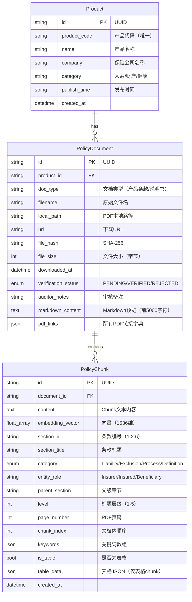

# data-model.md 优化补丁

## 🎯 使用说明

本文件包含需要更新到 `specs/001-insurance-mcp-core/data-model.md` 和 `src/common/models.py` 中的数据模型改进。

---

## 补丁 1: 更新 PolicyChunk 实体（概念模型）

**位置**: 替换 `data-model.md` 中的 `PolicyChunk` 部分

```markdown
### PolicyChunk (条款切片 / 语义块)

**用途**: 用于向量索引和检索的文本段，每个chunk代表一个逻辑完整的语义单元。

**属性**:

| 字段名 | 类型 | 必需 | 说明 | 示例 |
|--------|-----|------|------|------|
| `id` | string | ✅ | Chunk唯一标识 | "doc123_chunk_005" |
| `document_id` | string | ✅ | 关联的PolicyDocument ID | "doc123" |
| `content` | text | ✅ | Chunk文本内容 | "1.2.6 身故保险金 若被保险人在..." |
| `embedding_vector` | float[] | ⏳ | OpenAI生成的向量（1536维） | [0.001, 0.023, ...] |
| **`section_id`** | string | ✅ | **条款编号** | "1.2.6" |
| **`section_title`** | string | ✅ | **条款标题** | "身故保险金" |
| **`category`** | enum | ✅ | **条款类型** | "Liability" / "Exclusion" / "Process" / "Definition" |
| **`entity_role`** | string | ⏹️ | **主体角色** | "Insurer" / "Insured" / "Beneficiary" |
| **`parent_section`** | string | ⏹️ | **父级章节编号** | "1.2" |
| **`level`** | int | ✅ | **标题层级** | 3 (对应 ###) |
| `page_number` | int | ⏹️ | 原PDF页码 | 12 |
| **`chunk_index`** | int | ✅ | **文档内顺序** | 15 |
| **`keywords`** | string[] | ⏹️ | **关键词提取** | ["身故", "保险金", "受益人"] |
| **`is_table`** | bool | ✅ | **是否为表格** | true / false |
| **`table_data`** | json | ⏹️ | **表格JSON结构** | {"headers": [...], "rows": [[...]]} |
| `created_at` | datetime | ✅ | 创建时间 | "2025-11-21T10:00:00Z" |

**新增字段说明**（相对于原始设计）：

1. **`section_id`**: 条款编号，用于精确匹配和引用
   - 提取规则：从Markdown标题中解析（如 "### 1.2.6 身故保险金" → "1.2.6"）
   - 用途：支持 "查询1.2.1条款" 这类精确检索

2. **`category`**: 条款类型分类，支持按类型过滤检索
   - **Liability**: 保险责任条款（包含"保险责任"、"我们给付"等关键词）
   - **Exclusion**: 责任免除条款（包含"责任免除"、"我们不承担"等关键词）
   - **Process**: 流程类条款（包含"申请"、"理赔"、"手续"等关键词）
   - **Definition**: 定义类条款（包含"本合同所称"、"定义"等关键词）

3. **`entity_role`**: 条款中的主体角色
   - 用于识别条款适用主体（保险人/被保险人/受益人）
   - 示例：包含"被保险人应在..."的条款 → entity_role = "Insured"

4. **`parent_section`**: 父级章节编号
   - 用于重建条款的层级结构
   - 示例：section_id="1.2.6" → parent_section="1.2"

5. **`level`**: 标题层级
   - 用于判断条款的重要性和层级深度
   - 对应Markdown标题：# (1级) / ## (2级) / ### (3级)

6. **`is_table`**: 表格标记
   - 用于识别chunk是否为表格类型
   - 表格chunk在检索时需特殊处理（如强调表格标题）

7. **`table_data`**: 表格JSON结构
   - 仅在 `is_table=true` 时存在
   - 保留表格的行列结构，防止信息丢失

**存储位置**:
- **content, embedding_vector**: ChromaDB (向量数据库)
- **所有metadata字段**: ChromaDB的metadata字段（支持过滤查询）
- **备份**: SQLite中可选存储chunk索引（用于追溯和管理）

**设计原则**:
1. **语义完整性**: 一个chunk对应一个完整的逻辑单元（条款、段落、表格）
2. **可追溯性**: 每个chunk都能精确回溯到原始PDF的页码和章节
3. **可过滤性**: 丰富的metadata支持精准过滤（按类型、角色、章节）
4. **可扩展性**: metadata字段支持后续添加新的分类维度
```

---

## 补丁 2: ER图更新

**位置**: 替换 `data-model.md` 中的 ER 图



---

## 补丁 3: ChromaDB Collection Schema

**位置**: 在 `data-model.md` 末尾添加

```markdown
## ChromaDB Collection设计

### Collection: `insurance_policy_chunks`

**向量维度**: 1536 (OpenAI text-embedding-3-small)

**距离度量**: cosine

**Metadata Schema**:

```json
{
  "document_id": "string",
  "product_id": "string",
  "product_name": "string",
  "company": "string",
  
  "section_id": "string",
  "section_title": "string",
  "category": "string (Liability/Exclusion/Process/Definition)",
  "entity_role": "string (Insurer/Insured/Beneficiary)",
  "parent_section": "string",
  "level": "integer",
  
  "page_number": "integer",
  "chunk_index": "integer",
  "keywords": ["string"],
  
  "is_table": "boolean",
  "table_data": {
    "type": "string",
    "headers": ["string"],
    "rows": [["string"]],
    "row_count": "integer",
    "column_count": "integer"
  },
  
  "source_pdf_path": "string",
  "source_url": "string",
  "created_at": "string (ISO 8601)"
}
```

**查询示例**:

```python
# 基础语义查询
results = collection.query(
    query_texts=["保险期间多久？"],
    n_results=5,
    where={"company": "平安人寿"}
)

# 免责条款专项查询
results = collection.query(
    query_texts=["酒驾出事赔吗？"],
    n_results=10,
    where={
        "$and": [
            {"category": "Exclusion"},
            {"company": "平安人寿"}
        ]
    }
)

# 表格查询
results = collection.query(
    query_texts=["减额交清表格"],
    n_results=5,
    where={"is_table": True}
)

# 特定条款查询（精确匹配）
results = collection.get(
    where={"section_id": "1.2.6"}
)
```

**索引优化**:
- 对 `category`, `company`, `product_id` 建立索引
- 对 `is_table`, `level` 建立索引
- 对 `section_id` 建立唯一索引（配合精确查询）
```

---

## 补丁 4: Pydantic模型实现（Python代码）

**文件**: `src/common/models.py`

**位置**: 替换或扩展现有的 `PolicyChunk` 类

```python
from pydantic import BaseModel, Field
from typing import List, Optional, Dict, Literal
from datetime import datetime
from enum import Enum

# ... (保留现有的 Product 和 PolicyDocument 模型) ...

class ClauseCategory(str, Enum):
    """条款类型枚举"""
    LIABILITY = "Liability"      # 保险责任
    EXCLUSION = "Exclusion"      # 责任免除
    PROCESS = "Process"          # 流程
    DEFINITION = "Definition"    # 定义

class EntityRole(str, Enum):
    """主体角色枚举"""
    INSURER = "Insurer"          # 保险人（我们）
    INSURED = "Insured"          # 被保险人
    BENEFICIARY = "Beneficiary"  # 受益人

class TableData(BaseModel):
    """表格数据结构"""
    table_type: str = Field(..., description="表格类型，如'减额交清对比表'")
    headers: List[str] = Field(..., description="表头列表")
    rows: List[List[str]] = Field(..., description="数据行列表")
    row_count: int = Field(..., description="行数")
    column_count: int = Field(..., description="列数")
    
    class Config:
        schema_extra = {
            "example": {
                "table_type": "减额交清对比表",
                "headers": ["保单年度", "减额后年金", "备注"],
                "rows": [
                    ["第5年", "1000元/年", "终身领取"],
                    ["第10年", "1500元/年", "终身领取"]
                ],
                "row_count": 2,
                "column_count": 3
            }
        }

class PolicyChunk(BaseModel):
    """
    条款切片（语义块）
    
    用于向量索引和检索的文本段，包含丰富的元数据以支持精准过滤。
    """
    
    # 核心标识
    id: str = Field(
        default_factory=lambda: f"chunk_{uuid.uuid4().hex[:12]}",
        description="Chunk唯一标识"
    )
    document_id: str = Field(..., description="关联的PolicyDocument ID")
    
    # 内容字段
    content: str = Field(..., description="Chunk文本内容")
    embedding_vector: Optional[List[float]] = Field(
        None, 
        description="OpenAI生成的向量（1536维）"
    )
    
    # 结构化元数据（新增/增强）
    section_id: str = Field(..., description="条款编号，如'1.2.6'")
    section_title: str = Field(..., description="条款标题，如'身故保险金'")
    category: ClauseCategory = Field(..., description="条款类型")
    entity_role: Optional[EntityRole] = Field(None, description="主体角色")
    parent_section: Optional[str] = Field(None, description="父级章节编号，如'1.2'")
    level: int = Field(..., ge=1, le=5, description="标题层级（1-5）")
    
    # 位置信息
    page_number: Optional[int] = Field(None, description="原PDF页码")
    chunk_index: int = Field(..., description="在文档中的顺序")
    
    # 语义增强
    keywords: List[str] = Field(default_factory=list, description="提取的关键词")
    
    # 表格专用字段
    is_table: bool = Field(default=False, description="是否为表格chunk")
    table_data: Optional[TableData] = Field(None, description="表格JSON结构")
    
    # 时间戳
    created_at: datetime = Field(default_factory=datetime.now)
    
    class Config:
        use_enum_values = True
        schema_extra = {
            "example": {
                "id": "chunk_a1b2c3d4e5f6",
                "document_id": "doc_067afcfc",
                "content": "1.2.6 身故保险金\n若被保险人在保险期间内身故...",
                "section_id": "1.2.6",
                "section_title": "身故保险金",
                "category": "Liability",
                "entity_role": "Insurer",
                "parent_section": "1.2",
                "level": 3,
                "page_number": 12,
                "chunk_index": 15,
                "keywords": ["身故", "保险金", "受益人"],
                "is_table": False,
                "table_data": None
            }
        }
    
    def to_chroma_metadata(self) -> Dict:
        """
        转换为ChromaDB metadata格式
        
        ChromaDB对metadata有限制：
        - 不支持嵌套对象
        - 不支持list of objects
        - 数值类型需要是int/float
        """
        metadata = {
            "document_id": self.document_id,
            "section_id": self.section_id,
            "section_title": self.section_title,
            "category": self.category.value,
            "level": self.level,
            "chunk_index": self.chunk_index,
            "is_table": self.is_table,
        }
        
        # 可选字段
        if self.entity_role:
            metadata["entity_role"] = self.entity_role.value
        if self.parent_section:
            metadata["parent_section"] = self.parent_section
        if self.page_number:
            metadata["page_number"] = self.page_number
        
        # keywords作为字符串存储（ChromaDB限制）
        if self.keywords:
            metadata["keywords"] = ",".join(self.keywords)
        
        # table_data序列化为JSON字符串
        if self.table_data:
            import json
            metadata["table_data"] = json.dumps(self.table_data.dict())
        
        return metadata
    
    @classmethod
    def from_chroma_result(cls, chroma_result: Dict) -> "PolicyChunk":
        """从ChromaDB查询结果构建PolicyChunk"""
        import json
        
        metadata = chroma_result.get("metadatas", [{}])[0]
        
        # 反序列化keywords
        keywords = []
        if "keywords" in metadata:
            keywords = metadata["keywords"].split(",")
        
        # 反序列化table_data
        table_data = None
        if metadata.get("table_data"):
            table_data = TableData(**json.loads(metadata["table_data"]))
        
        return cls(
            id=chroma_result["ids"][0],
            document_id=metadata["document_id"],
            content=chroma_result["documents"][0],
            embedding_vector=chroma_result.get("embeddings", [None])[0],
            section_id=metadata["section_id"],
            section_title=metadata["section_title"],
            category=metadata["category"],
            entity_role=metadata.get("entity_role"),
            parent_section=metadata.get("parent_section"),
            level=metadata["level"],
            page_number=metadata.get("page_number"),
            chunk_index=metadata["chunk_index"],
            keywords=keywords,
            is_table=metadata.get("is_table", False),
            table_data=table_data
        )


# Helper函数
def classify_category(content: str) -> ClauseCategory:
    """
    根据内容自动分类条款类型
    
    使用规则引擎+关键词匹配
    """
    content_lower = content.lower()
    
    # 免责条款特征
    exclusion_keywords = ["责任免除", "我们不承担", "除外", "不负责", "免除责任"]
    if any(kw in content for kw in exclusion_keywords):
        return ClauseCategory.EXCLUSION
    
    # 保险责任特征
    liability_keywords = ["保险责任", "我们给付", "保险金", "我们支付", "承担责任"]
    if any(kw in content for kw in liability_keywords):
        return ClauseCategory.LIABILITY
    
    # 流程类特征
    process_keywords = ["申请", "理赔", "手续", "流程", "提交材料", "审核"]
    if any(kw in content for kw in process_keywords):
        return ClauseCategory.PROCESS
    
    # 定义类特征
    definition_keywords = ["本合同所称", "定义", "指", "是指", "本条款中"]
    if any(kw in content for kw in definition_keywords):
        return ClauseCategory.DEFINITION
    
    # 默认为流程类（兜底）
    return ClauseCategory.PROCESS

def identify_entity_role(content: str) -> Optional[EntityRole]:
    """
    识别条款中的主体角色
    
    基于关键词出现频率判断
    """
    insurer_keywords = ["我们", "本公司", "保险人"]
    insured_keywords = ["被保险人", "您的孩子", "受保人"]
    beneficiary_keywords = ["受益人", "继承人"]
    
    insurer_count = sum(content.count(kw) for kw in insurer_keywords)
    insured_count = sum(content.count(kw) for kw in insured_keywords)
    beneficiary_count = sum(content.count(kw) for kw in beneficiary_keywords)
    
    max_count = max(insurer_count, insured_count, beneficiary_count)
    
    if max_count == 0:
        return None
    
    if insurer_count == max_count:
        return EntityRole.INSURER
    elif insured_count == max_count:
        return EntityRole.INSURED
    else:
        return EntityRole.BENEFICIARY
```

---

## 补丁 5: 数据迁移脚本

**文件**: `scripts/migrate_add_chunk_metadata.py`

```python
"""
数据迁移脚本：为现有chunks添加新的metadata字段

使用场景：
- 已有ChromaDB索引的情况下，需要添加新字段
- 建议在低峰期执行
"""

import chromadb
from pathlib import Path
import json
from tqdm import tqdm

from src.common.models import PolicyChunk, classify_category, identify_entity_role
from src.common.config import config

def migrate_chunks():
    """为现有chunks添加metadata"""
    
    # 连接ChromaDB
    client = chromadb.PersistentClient(path=str(config.VECTOR_STORE_DIR))
    collection = client.get_or_create_collection(
        name="insurance_policy_chunks",
        metadata={"hnsw:space": "cosine"}
    )
    
    print(f"加载现有chunks...")
    all_chunks = collection.get()
    total = len(all_chunks["ids"])
    
    print(f"找到 {total} 个chunks，开始迁移...")
    
    updated_count = 0
    for i in tqdm(range(total)):
        chunk_id = all_chunks["ids"][i]
        content = all_chunks["documents"][i]
        old_metadata = all_chunks["metadatas"][i]
        
        # 如果已有新字段，跳过
        if "category" in old_metadata:
            continue
        
        # 自动分类
        category = classify_category(content)
        entity_role = identify_entity_role(content)
        
        # 提取关键词（简单版本：使用TF-IDF）
        keywords = extract_keywords(content, top_k=5)
        
        # 更新metadata
        new_metadata = {
            **old_metadata,
            "category": category.value,
            "keywords": ",".join(keywords)
        }
        
        if entity_role:
            new_metadata["entity_role"] = entity_role.value
        
        # 更新到ChromaDB
        collection.update(
            ids=[chunk_id],
            metadatas=[new_metadata]
        )
        
        updated_count += 1
    
    print(f"✅ 迁移完成！更新了 {updated_count} 个chunks")

def extract_keywords(text: str, top_k: int = 5) -> list:
    """简单的关键词提取（基于词频）"""
    import jieba
    from collections import Counter
    
    # 分词
    words = jieba.cut(text)
    
    # 过滤停用词
    stopwords = {"的", "了", "在", "是", "我", "有", "和", "就", "不", "人", "都", "一", "一个", "上", "也", "很", "到", "说", "要", "去", "你", "会", "着", "没有", "看", "好", "自己", "这"}
    words = [w for w in words if len(w) > 1 and w not in stopwords]
    
    # 统计词频
    counter = Counter(words)
    
    # 返回top-k
    return [word for word, _ in counter.most_common(top_k)]

if __name__ == "__main__":
    migrate_chunks()
```

---

## 使用检查清单

在应用此补丁前，请确认：

- [ ] 已备份现有ChromaDB数据（如有）
- [ ] 已阅读并理解新增的metadata字段含义
- [ ] 已更新 `src/common/models.py` 中的 `PolicyChunk` 类
- [ ] 已更新 `data-model.md` 中的 ER 图和字段说明
- [ ] 如有现有索引，已准备好迁移脚本
- [ ] 已安装新依赖：`jieba`（用于中文关键词提取）

---

## 应用后验证步骤

1. **单元测试**:
   ```bash
   pytest tests/unit/test_models.py::test_policy_chunk_metadata
   ```

2. **创建测试chunk**:
   ```python
   from src.common.models import PolicyChunk, ClauseCategory
   
   chunk = PolicyChunk(
       document_id="test_doc",
       content="1.2.6 身故保险金\n若被保险人在保险期间内身故...",
       section_id="1.2.6",
       section_title="身故保险金",
       category=ClauseCategory.LIABILITY,
       level=3,
       chunk_index=15
   )
   
   # 转换为ChromaDB metadata
   metadata = chunk.to_chroma_metadata()
   print(metadata)
   ```

3. **验证ChromaDB查询**:
   ```python
   # 测试category过滤
   results = collection.query(
       query_texts=["免责条款"],
       where={"category": "Exclusion"},
       n_results=5
   )
   assert all(r["category"] == "Exclusion" for r in results["metadatas"])
   ```

4. **运行迁移脚本**（如有现有数据）:
   ```bash
   python scripts/migrate_add_chunk_metadata.py
   ```

---

**数据模型优化完成。符合第一性原理的保险条款结构化设计。**

