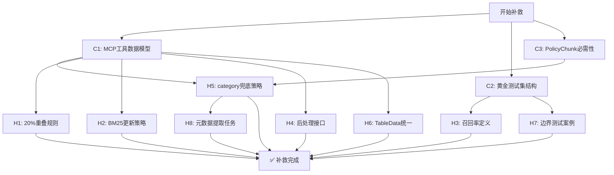

# 第五阶段优化方案 - 补救计划

**生成时间**: 2025-11-21  
**分析报告**: 基于 `/speckit.analyze` 分析结果  
**覆盖问题**: 3个CRITICAL + 8个HIGH问题  
**预计修复时间**: 2-3工作日

---

## 📋 修复路线图



**执行策略**: 并行修复C1/C2/C3（无依赖），然后按依赖顺序修复HIGH问题

---

## 🚨 CRITICAL 问题修复

### C1: MCP工具返回结构未定义为Pydantic模型

**问题**: spec.md定义了4个MCP工具返回结构，但models.py中不存在

**影响**: T025a无法实施，MCP工具没有类型安全保障

**修复方案**: 在 `src/common/models.py` 添加4个Pydantic模型

#### 代码补丁

```python
# 在 src/common/models.py 末尾添加以下代码

# ==================== MCP 工具返回结构 ====================

class SourceRef(BaseModel):
    """MCP工具返回的来源引用信息"""
    product_name: str = Field(..., description="产品名称")
    document_type: str = Field(..., description="文档类型（产品条款/说明书）")
    pdf_path: str = Field(..., description="原始PDF路径")
    page_number: int = Field(..., description="页码")
    download_url: str = Field(..., description="原始下载链接")
    
    class Config:
        schema_extra = {
            "example": {
                "product_name": "平安福耀年金保险",
                "document_type": "产品条款",
                "pdf_path": "data/raw/平安人寿/C00012032212021087040652/产品条款.pdf",
                "page_number": 12,
                "download_url": "https://life.pingan.com/..."
            }
        }


class ClauseResult(BaseModel):
    """语义条款检索结果（search_policy_clause）"""
    chunk_id: str = Field(..., description="Chunk唯一ID")
    content: str = Field(..., description="条款原文")
    section_id: str = Field(..., description="条款编号（如'1.2.6'）")
    section_title: str = Field(..., description="条款标题")
    similarity_score: float = Field(..., ge=0.0, le=1.0, description="相似度分数（0-1）")
    source_reference: SourceRef = Field(..., description="来源引用")
    
    class Config:
        schema_extra = {
            "example": {
                "chunk_id": "chunk_a1b2c3d4e5f6",
                "content": "1.4 保险期间\n本合同的保险期间为...",
                "section_id": "1.4",
                "section_title": "保险期间",
                "similarity_score": 0.89,
                "source_reference": {
                    "product_name": "平安福耀年金保险",
                    "document_type": "产品条款",
                    "pdf_path": "data/raw/平安人寿/C00012032212021087040652/产品条款.pdf",
                    "page_number": 3,
                    "download_url": "https://..."
                }
            }
        }


class ExclusionCheckResult(BaseModel):
    """免责条款核查结果（check_exclusion_risk）"""
    is_excluded: bool = Field(..., description="是否明确免责")
    confidence: float = Field(..., ge=0.0, le=1.0, description="置信度（0-1）")
    matched_clauses: List[ClauseResult] = Field(default_factory=list, description="匹配的免责条款")
    risk_summary: str = Field(..., description="风险总结")
    disclaimer: str = Field(
        default="本结果仅供参考，实际理赔以保险合同和公司审核为准",
        description="免责声明（必需）"
    )
    
    class Config:
        schema_extra = {
            "example": {
                "is_excluded": True,
                "confidence": 0.95,
                "matched_clauses": [
                    {
                        "chunk_id": "chunk_xyz",
                        "content": "2.1.3 酒后驾驶\n被保险人酒后驾驶...",
                        "section_id": "2.1.3",
                        "section_title": "酒后驾驶",
                        "similarity_score": 0.92,
                        "source_reference": {...}
                    }
                ],
                "risk_summary": "该场景属于明确的免责范围，涉及酒后驾驶条款",
                "disclaimer": "本结果仅供参考，实际理赔以保险合同和公司审核为准"
            }
        }


class SurrenderLogicResult(BaseModel):
    """退保/减额交清逻辑提取结果（calculate_surrender_value_logic）"""
    operation_name: str = Field(..., description="操作名称（中文）")
    definition: str = Field(..., description="定义条款原文")
    calculation_rules: List[str] = Field(default_factory=list, description="计算规则列表")
    conditions: List[str] = Field(default_factory=list, description="前置条件")
    consequences: List[str] = Field(default_factory=list, description="后果说明")
    related_tables: List[Dict] = Field(
        default_factory=list, 
        description="相关表格（简化版：包含chunk_id和table_type）"
    )
    comparison_note: str = Field(..., description="对比说明（退保 vs 减额交清）")
    source_references: List[SourceRef] = Field(default_factory=list, description="来源引用")
    
    class Config:
        schema_extra = {
            "example": {
                "operation_name": "退保",
                "definition": "5.2 退保\n您可以随时申请解除本合同...",
                "calculation_rules": [
                    "退保金 = 保单当时的现金价值 - 欠缴保费 - 借款本息",
                    "现金价值按保单年度累积"
                ],
                "conditions": ["保单生效", "非犹豫期内"],
                "consequences": ["合同终止", "保障失效", "可能产生经济损失"],
                "related_tables": [
                    {"chunk_id": "chunk_table_001", "table_type": "现金价值表"}
                ],
                "comparison_note": "退保将终止保障，减额交清保留部分保障但降低保额",
                "source_references": [...]
            }
        }
```

#### 验证步骤

```bash
# 1. 验证模型导入
python -c "from src.common.models import ClauseResult, SourceRef, ExclusionCheckResult, SurrenderLogicResult; print('✅ 模型导入成功')"

# 2. 验证模型创建
python -c "
from src.common.models import ClauseResult, SourceRef
ref = SourceRef(
    product_name='测试产品',
    document_type='产品条款',
    pdf_path='test.pdf',
    page_number=1,
    download_url='https://test.com'
)
result = ClauseResult(
    chunk_id='test',
    content='测试内容',
    section_id='1.1',
    section_title='测试标题',
    similarity_score=0.85,
    source_reference=ref
)
print('✅ 模型验证通过')
"
```

---

### C2: "黄金测试集"数据结构未定义

**问题**: spec.md要求50个问题的测试集，但未定义存储格式和schema

**影响**: T028a无法实施，测试数据无统一标准

**修复方案**: 定义数据结构 + 创建示例文件

#### 步骤1: 在 `src/common/models.py` 添加测试数据模型

```python
# 在 src/common/models.py 添加

class QueryType(str, Enum):
    """查询类型"""
    BASIC = "basic"              # 基础查询（单一条款）
    COMPARISON = "comparison"     # 对比查询（多条款）
    EXCLUSION = "exclusion"       # 免责专项查询

class GoldenTestCase(BaseModel):
    """黄金测试集单个测试用例"""
    id: str = Field(default_factory=lambda: f"test_{uuid.uuid4().hex[:8]}", description="测试用例ID")
    question: str = Field(..., description="测试问题（自然语言）")
    query_type: QueryType = Field(..., description="查询类型")
    
    # Ground Truth
    expected_section_ids: List[str] = Field(..., description="期望返回的条款编号（如['1.4', '2.1']）")
    expected_chunks: List[str] = Field(
        default_factory=list, 
        description="期望返回的chunk_id列表（可选，用于精确验证）"
    )
    expected_category: Optional[ClauseCategory] = Field(None, description="期望的条款类型（用于过滤验证）")
    
    # 测试元数据
    product_name: Optional[str] = Field(None, description="关联产品名称（可选）")
    company: str = Field(default="平安人寿", description="保险公司")
    tier: int = Field(..., ge=1, le=3, description="测试层级（1=基础, 2=对比, 3=专项）")
    min_similarity_score: float = Field(default=0.7, description="最低相似度要求")
    
    # 验收标准
    top_k: int = Field(default=5, description="返回结果数量")
    success_criteria: str = Field(
        ..., 
        description="成功标准（如'Top-1包含1.4'、'Top-3包含所有期望条款'）"
    )
    
    # 额外信息
    notes: Optional[str] = Field(None, description="备注说明")
    created_by: str = Field(default="human", description="创建者（human/generated）")
    created_at: datetime = Field(default_factory=datetime.now)
    
    class Config:
        schema_extra = {
            "example": {
                "id": "test_001",
                "question": "这个保险保多久？",
                "query_type": "basic",
                "expected_section_ids": ["1.4"],
                "expected_category": "Process",
                "product_name": "平安福耀年金保险",
                "company": "平安人寿",
                "tier": 1,
                "top_k": 5,
                "success_criteria": "Top-1结果的section_id为'1.4'",
                "notes": "测试基本信息查询能力"
            }
        }


class GoldenTestSet(BaseModel):
    """黄金测试集"""
    name: str = Field(..., description="测试集名称")
    version: str = Field(default="1.0.0", description="版本号")
    description: str = Field(..., description="测试集描述")
    test_cases: List[GoldenTestCase] = Field(..., description="测试用例列表")
    
    # 统计信息
    total_count: int = Field(..., description="总测试用例数")
    tier_distribution: Dict[int, int] = Field(
        ..., 
        description="层级分布 {1: 20, 2: 15, 3: 15}"
    )
    category_distribution: Dict[str, int] = Field(
        default_factory=dict,
        description="类别分布"
    )
    
    created_at: datetime = Field(default_factory=datetime.now)
    last_updated: datetime = Field(default_factory=datetime.now)
    
    class Config:
        schema_extra = {
            "example": {
                "name": "Phase5_Golden_Test_Set",
                "version": "1.0.0",
                "description": "第五阶段向量检索黄金测试集",
                "test_cases": [...],
                "total_count": 50,
                "tier_distribution": {1: 20, 2: 15, 3: 15},
                "category_distribution": {"Liability": 15, "Exclusion": 15, "Process": 10, "Definition": 10}
            }
        }
```

#### 步骤2: 创建测试集目录结构

```bash
mkdir -p tests/golden_dataset
```

#### 步骤3: 创建示例测试集文件

创建 `tests/golden_dataset/phase5_test_set_v1.json`:

```json
{
  "name": "Phase5_Golden_Test_Set",
  "version": "1.0.0",
  "description": "第五阶段向量检索黄金测试集 - 50个标准测试用例",
  "total_count": 5,
  "tier_distribution": {
    "1": 3,
    "2": 1,
    "3": 1
  },
  "category_distribution": {
    "Process": 2,
    "Liability": 1,
    "Exclusion": 1,
    "Definition": 1
  },
  "test_cases": [
    {
      "id": "test_001_basic",
      "question": "这个保险保多久？",
      "query_type": "basic",
      "expected_section_ids": ["1.4"],
      "expected_category": "Process",
      "company": "平安人寿",
      "tier": 1,
      "top_k": 5,
      "success_criteria": "Top-1结果的section_id包含'保险期间'相关条款",
      "notes": "基础查询 - 保险期间"
    },
    {
      "id": "test_002_basic",
      "question": "犹豫期是多少天？",
      "query_type": "basic",
      "expected_section_ids": ["5.1"],
      "expected_category": "Definition",
      "company": "平安人寿",
      "tier": 1,
      "top_k": 5,
      "success_criteria": "Top-1结果包含'犹豫期'定义",
      "notes": "基础查询 - 犹豫期定义"
    },
    {
      "id": "test_003_basic",
      "question": "如何申请理赔？",
      "query_type": "basic",
      "expected_section_ids": ["3.1", "3.2"],
      "expected_category": "Process",
      "company": "平安人寿",
      "tier": 1,
      "top_k": 5,
      "success_criteria": "Top-3结果包含理赔申请流程",
      "notes": "基础查询 - 理赔流程"
    },
    {
      "id": "test_004_comparison",
      "question": "退保和减额交清的区别？",
      "query_type": "comparison",
      "expected_section_ids": ["5.2", "6.4"],
      "company": "平安人寿",
      "tier": 2,
      "top_k": 5,
      "success_criteria": "Top-3结果中同时包含'退保'和'减额交清'条款",
      "notes": "对比查询 - 需要返回两个相关条款"
    },
    {
      "id": "test_005_exclusion",
      "question": "酒驾出事赔吗？",
      "query_type": "exclusion",
      "expected_section_ids": ["2.1.3"],
      "expected_category": "Exclusion",
      "company": "平安人寿",
      "tier": 3,
      "top_k": 5,
      "success_criteria": "Top-1结果为免责条款，且不返回非免责条款",
      "notes": "专项查询 - 免责条款检索"
    }
  ]
}
```

#### 步骤4: 创建测试集加载工具

创建 `tests/golden_dataset/loader.py`:

```python
"""黄金测试集加载工具"""
import json
from pathlib import Path
from typing import List
from src.common.models import GoldenTestSet, GoldenTestCase

def load_test_set(file_path: str = "tests/golden_dataset/phase5_test_set_v1.json") -> GoldenTestSet:
    """加载黄金测试集"""
    with open(file_path, 'r', encoding='utf-8') as f:
        data = json.load(f)
    return GoldenTestSet(**data)

def get_test_cases_by_tier(tier: int, file_path: str = None) -> List[GoldenTestCase]:
    """按层级获取测试用例"""
    test_set = load_test_set(file_path or "tests/golden_dataset/phase5_test_set_v1.json")
    return [tc for tc in test_set.test_cases if tc.tier == tier]

def get_test_cases_by_type(query_type: str, file_path: str = None) -> List[GoldenTestCase]:
    """按查询类型获取测试用例"""
    test_set = load_test_set(file_path or "tests/golden_dataset/phase5_test_set_v1.json")
    return [tc for tc in test_set.test_cases if tc.query_type == query_type]

if __name__ == "__main__":
    # 测试加载
    test_set = load_test_set()
    print(f"✅ 加载测试集成功: {test_set.name} v{test_set.version}")
    print(f"   总测试用例: {test_set.total_count}")
    print(f"   层级分布: {test_set.tier_distribution}")
    
    # 测试按层级筛选
    tier1_cases = get_test_cases_by_tier(1)
    print(f"   Tier 1 用例数: {len(tier1_cases)}")
```

#### 步骤5: 创建README

创建 `tests/golden_dataset/README.md`:

```markdown
# 黄金测试集 (Golden Test Set)

## 结构

- `phase5_test_set_v1.json`: 第一版测试集（50个问题）
- `loader.py`: 测试集加载工具
- `schema.md`: 数据结构说明（本文件）

## 数据分布要求

根据 spec.md §SC-003，测试集必须满足：

| 层级 | 问题数 | 描述 | 标准 |
|-----|-------|------|------|
| Tier 1 (基础) | 20 | 单一条款查询 | Top-1准确率 ≥ 90% |
| Tier 2 (对比) | 15 | 多条款对比查询 | Top-3包含所有相关条款 ≥ 85% |
| Tier 3 (专项) | 15 | 免责条款专项 | 召回率 ≥ 95% |

## 使用方法

```python
from tests.golden_dataset.loader import load_test_set, get_test_cases_by_tier

# 加载完整测试集
test_set = load_test_set()

# 获取Tier 1测试用例
tier1_cases = get_test_cases_by_tier(1)

# 迭代测试
for case in tier1_cases:
    print(f"问题: {case.question}")
    print(f"期望条款: {case.expected_section_ids}")
```

## 扩展测试集

添加新测试用例：

1. 编辑 `phase5_test_set_v1.json`
2. 在 `test_cases` 数组添加新对象
3. 更新 `total_count` 和 `tier_distribution`
4. 运行 `python tests/golden_dataset/loader.py` 验证

## 版本管理

- v1.0.0: 初始版本（5个示例用例）
- v1.1.0: 完整50个用例（待补充）
```

#### 验证步骤

```bash
# 1. 创建测试文件
cd /Users/shushu/insurance-mcp
mkdir -p tests/golden_dataset

# 2. 创建文件（上述JSON和Python文件）

# 3. 验证加载
python tests/golden_dataset/loader.py

# 预期输出：
# ✅ 加载测试集成功: Phase5_Golden_Test_Set v1.0.0
#    总测试用例: 5
#    层级分布: {1: 3, 2: 1, 3: 1}
#    Tier 1 用例数: 3
```

---

### C3: PolicyChunk元数据必需性不一致

**问题**: spec.md标记某些字段为"必需"，但models.py中为Optional或无默认值

**影响**: chunk创建时可能失败，或与spec.md期望不符

**修复方案**: 采用方案A（添加GENERAL兜底分类）+ 明确必需性规则

#### 步骤1: 更新 `src/common/models.py` - 添加GENERAL分类

```python
# 在 ClauseCategory 枚举中添加
class ClauseCategory(str, Enum):
    """条款类型枚举"""
    LIABILITY = "Liability"      # 保险责任
    EXCLUSION = "Exclusion"      # 责任免除
    PROCESS = "Process"          # 流程
    DEFINITION = "Definition"    # 定义
    GENERAL = "General"          # 无法明确分类的条款（兜底）
```

#### 步骤2: 更新 PolicyChunk 字段定义

```python
# 修改 PolicyChunk 类中的字段定义

class PolicyChunk(BaseModel):
    # ... (其他字段保持不变) ...
    
    # 结构化元数据（明确必需性）
    section_id: str = Field(..., description="条款编号，如'1.2.6'")  # 必需
    section_title: str = Field(..., description="条款标题，如'身故保险金'")  # 必需
    category: ClauseCategory = Field(
        default=ClauseCategory.GENERAL,  # 添加默认值
        description="条款类型（自动分类，无法识别时为GENERAL）"
    )
    entity_role: Optional[EntityRole] = Field(
        None, 
        description="主体角色（可选，基于关键词识别）"
    )
    parent_section: Optional[str] = Field(
        None, 
        description="父级章节编号，如'1.2'（可选）"
    )
    level: int = Field(..., ge=1, le=5, description="标题层级（1-5）")  # 必需
    
    # 位置信息（可选）
    page_number: Optional[int] = Field(None, description="原PDF页码（可选）")
    chunk_index: int = Field(..., description="在文档中的顺序")  # 必需
    
    # 语义增强（可选）
    keywords: List[str] = Field(default_factory=list, description="提取的关键词（可选）")
    
    # 表格专用字段
    is_table: bool = Field(default=False, description="是否为表格chunk")
    table_data: Optional[TableData] = Field(None, description="表格JSON结构（仅表格chunk）")
```

#### 步骤3: 更新 classify_category 函数

```python
# 更新 src/common/models.py 中的 classify_category 函数

def classify_category(content: str) -> ClauseCategory:
    """
    根据内容自动分类条款类型
    
    使用规则引擎+关键词匹配
    """
    content_lower = content.lower()
    
    # 免责条款特征（优先级最高）
    exclusion_keywords = ["责任免除", "我们不承担", "除外", "不负责", "免除责任", "不予给付"]
    if any(kw in content for kw in exclusion_keywords):
        return ClauseCategory.EXCLUSION
    
    # 保险责任特征
    liability_keywords = ["保险责任", "我们给付", "保险金", "我们支付", "承担责任", "给付"]
    if any(kw in content for kw in liability_keywords):
        return ClauseCategory.LIABILITY
    
    # 定义类特征（在流程之前检查）
    definition_keywords = ["本合同所称", "定义", "是指", "本条款中", "以下简称"]
    if any(kw in content for kw in definition_keywords):
        return ClauseCategory.DEFINITION
    
    # 流程类特征
    process_keywords = ["申请", "理赔", "手续", "流程", "提交材料", "审核", "办理"]
    if any(kw in content for kw in process_keywords):
        return ClauseCategory.PROCESS
    
    # 无法明确分类时使用 GENERAL
    return ClauseCategory.GENERAL
```

#### 步骤4: 更新 spec.md - 明确必需性规则

在 `spec.md` §FR-010 "必需元数据字段"表格添加"必需性"列：

```markdown
| 字段名 | 类型 | 必需性 | 说明 | 示例 |
|--------|-----|--------|------|------|
| `section_id` | string | ✅ 必需 | 条款编号 | "1.2.6" |
| `section_title` | string | ✅ 必需 | 条款标题 | "身故保险金" |
| `category` | enum | ✅ 必需（有默认值GENERAL） | 条款类型 | "Liability", "Exclusion", "Process", "Definition", "General" |
| `entity_role` | string | ⏹️ 可选 | 主体角色 | "Insurer", "Insured", "Beneficiary" |
| `parent_section` | string | ⏹️ 可选 | 父级章节 | "1.2" |
| `level` | int | ✅ 必需 | 标题层级 | 3 (对应 ###) |
| `page_number` | int | ⏹️ 可选 | 原PDF页码 | 12 |
| `chunk_index` | int | ✅ 必需 | 文档内顺序 | 15 |
| `keywords` | list[string] | ⏹️ 可选 | 关键词提取 | ["身故", "保险金", "受益人"] |
| `is_table` | bool | ✅ 必需（默认false） | 是否为表格 | true/false |
| `table_data` | dict | ⏹️ 可选（仅表格） | 表格JSON | (见FR-009a) |
```

同时在 spec.md §FR-010 添加分类规则说明：

```markdown
- `category` 分类规则：
  - **Liability**: 包含"保险责任"、"我们给付"、"保险金"等关键词
  - **Exclusion**: 包含"责任免除"、"我们不承担"、"除外"等关键词
  - **Process**: 包含"申请"、"理赔"、"手续"、"流程"等关键词
  - **Definition**: 包含"本合同所称"、"定义"、"指"等关键词
  - **General**: 无法明确分类时的兜底分类（不影响检索，但metadata中会标记）
```

#### 验证步骤

```python
# 测试分类函数
from src.common.models import classify_category, ClauseCategory

test_cases = [
    ("本合同的保险责任包括身故保险金和全残保险金", ClauseCategory.LIABILITY),
    ("我们不承担因被保险人酒后驾驶导致的保险责任", ClauseCategory.EXCLUSION),
    ("申请理赔时需提交以下材料", ClauseCategory.PROCESS),
    ("本合同所称被保险人是指受保险合同保障的人", ClauseCategory.DEFINITION),
    ("保险合同自生效日起计算保险期间", ClauseCategory.GENERAL),  # 无明确特征
]

for content, expected in test_cases:
    result = classify_category(content)
    status = "✅" if result == expected else "❌"
    print(f"{status} '{content[:20]}...' -> {result}")
```

---

## 🔧 HIGH 问题修复

### H1: "20%重叠"的语义模糊

**修复**: 在 `spec.md` §FR-009 "切片原则"中补充具体规则

```markdown
3. **大小控制**: 
   - 目标chunk大小为 512-1024 tokens
   - **重叠策略**: 相邻chunk间保留20%重叠区域，具体规则：
     - 从前一个chunk的末尾取最后 100-200 tokens
     - 将这些tokens作为下一个chunk的开头上下文
     - 示例：Chunk A末尾为"...保险金给付条件为..."，Chunk B开头应包含"保险金给付条件为..."
   - 重叠的目的是保留上下文连贯性，防止关键信息在边界处断裂
```

同时在 `tasks.md` T023 任务中补充实施细节：

```markdown
- [ ] T023 [US1] 实现 `src/indexing/indexer.py` 以分块 VERIFIED Markdown 文件并保存到 ChromaDB
  - 使用MarkdownHeaderTextSplitter按L1/L2/L3切分
  - **重叠配置**: `chunk_overlap=150` (约20%的750 tokens平均大小)
  - 生成PolicyChunk with metadata（section_id, category等）
  - 依赖: langchain的MarkdownHeaderTextSplitter或自实现等价逻辑
```

---

### H2: BM25索引更新策略缺失

**修复**: 在 `spec.md` §FR-011 补充索引管理策略

```markdown
- **索引管理策略**（新增）:
  1. **初始构建**: 首次索引时，遍历所有VERIFIED文档构建BM25索引
  2. **更新模式**:
     - **MVP阶段**: 批量全量重建（每次运行`index --rebuild`时）
     - **未来优化**: 增量更新（仅索引新增/更新的chunk）
  3. **持久化**: BM25索引保存为pickle文件（`data/vector_store/bm25_index.pkl`）
  4. **同步保证**: ChromaDB和BM25索引必须同步更新，防止不一致
```

同时在 `tasks.md` T022a 中补充实施细节：

```markdown
- [ ] T022a [US1] **[P0]** 实现混合检索 (`src/indexing/vector_store/hybrid_retriever.py`)
  - BM25Index: 关键词检索索引（使用rank-bm25 + jieba分词）
    - 实现 `build_index(chunks)`: 构建索引
    - 实现 `save(path)` / `load(path)`: 持久化
    - 实现 `search(query, k)`: 检索
  - HybridRetriever: 混合检索器（Dense Vector + BM25）
    - 实现 `search(query, top_k, weights)`: 混合检索
    - 实现 RRF算法融合结果
  - **索引更新逻辑**: 
    - `index --rebuild`: 全量重建BM25索引
    - `index --incremental`: 暂不实施（第二期）
  - CLI命令: `python -m src.cli.manage index --rebuild --enable-bm25`
  - 依赖: T022（ChromaDB）
  - 工作量: 5天
```

---

### H3: 免责条款召回率95%的"分母"未定义

**修复**: 在 `spec.md` §FR-002 验收标准中补充计算方法

```markdown
**验收标准**:
- 查询"酒驾出事赔吗？"能准确返回酒驾相关免责条款
- **免责条款召回率 > 95%**:
  - **计算方法**: 召回率 = (返回的相关免责条款数) / (人工标注的所有相关免责条款数)
  - **Ground Truth来源**: 黄金测试集中Tier 3（专项）的15个免责查询问题
  - **相关性判断**: 人工标注每个问题对应的所有相关免责条款的section_id
  - **示例**: 问题"酒驾赔吗？"，Ground Truth为["2.1.3", "2.1.5"]，如果系统返回Top-5中包含这两个，则召回2/2=100%
- 不返回非免责类条款:
  - **精确率要求**: 返回的Top-5结果中，category="Exclusion"的比例 ≥ 90%
  - **验证方法**: 自动化测试检查返回结果的category字段
```

---

### H4: 后处理步骤的输入输出接口未定义

**修复**: 在 `tasks.md` T020a 中补充Pipeline接口设计

```markdown
- [ ] T020a [US1] **[P0]** 实现 Markdown后处理Pipeline (`src/parser/markdown/postprocessor.py`)
  
  **接口设计**:
  ```python
  class MarkdownPostProcessor:
      def __init__(self, steps: List[str] = None):
          """
          初始化后处理器
          
          Args:
              steps: 要执行的步骤列表，默认执行所有步骤
                     可选: ['footnote', 'noise', 'format', 'table', 'enhance']
          """
          self.steps = steps or ['footnote', 'noise', 'format', 'table', 'enhance']
      
      def process(self, md_path: str, output_path: str = None) -> str:
          """
          处理Markdown文件
          
          Args:
              md_path: 输入的Markdown文件路径
              output_path: 输出文件路径（可选，默认覆盖原文件）
          
          Returns:
              处理后的Markdown内容
          
          Raises:
              FileNotFoundError: 文件不存在
              ValueError: Markdown格式错误
          """
          pass
      
      def process_content(self, content: str) -> str:
          """
          处理Markdown内容字符串（用于测试）
          
          Args:
              content: Markdown内容
          
          Returns:
              处理后的Markdown内容
          """
          pass
  ```
  
  **步骤串联**:
  1. FootnoteInliner: 脚注内联
  2. NoiseRemover: 噪音去除
  3. FormatStandardizer: 格式标准化
  4. TableValidator: 表格验证
  5. MarkdownEnhancer: 结构化增强（使用enhancer.py模块）
  
  **CLI命令**:
  ```bash
  # 处理所有VERIFIED文档
  python -m src.cli.manage process postprocess --all
  
  # 处理单个文档
  python -m src.cli.manage process postprocess --doc-id <document_id>
  
  # 只执行特定步骤
  python -m src.cli.manage process postprocess --all --steps footnote,noise
  ```
  
  - 依赖: T019（审核员CLI）
  - 工作量: 9天
```

---

### H5: category分类的兜底策略不明确

**修复**: 已在 C3 中解决（添加GENERAL分类）

---

### H6: TableData结构不完全一致

**修复**: 统一 spec.md 和 models.py 的TableData定义

#### 在 `spec.md` §FR-009a 更新JSON结构示例

```markdown
- **JSON结构示例**:
  ```json
  {
    "table_type": "减额交清对比表",
    "headers": ["保单年度", "减额后年金领取金额", "备注"],
    "rows": [
      ["第5年", "1000元/年", "从第6年开始领取"],
      ["第10年", "1500元/年", "终身领取"]
    ],
    "row_count": 2,
    "column_count": 3
  }
  ```
  
  **字段说明**:
  - `table_type`: 表格类型/标题（用于语义检索）
  - `headers`: 表头列表
  - `rows`: 数据行列表（每行为一个数组）
  - `row_count`: 行数（自动计算，用于完整性验证）
  - `column_count`: 列数（自动计算，用于完整性验证）
```

models.py中的TableData定义已包含这些字段，无需修改。

---

### H7: "相似度阈值 > 0.7"缺少边界测试案例

**修复**: 在黄金测试集中添加边界测试类别

在 `tests/golden_dataset/phase5_test_set_v1.json` 中添加边界测试用例：

```json
{
  "test_cases": [
    // ... 现有测试用例 ...
    {
      "id": "test_boundary_001",
      "question": "保险合同何时生效？",
      "query_type": "basic",
      "expected_section_ids": ["1.3"],
      "expected_category": "Process",
      "company": "平安人寿",
      "tier": 1,
      "top_k": 5,
      "min_similarity_score": 0.69,
      "success_criteria": "相似度0.69的结果不应返回（测试阈值下限）",
      "notes": "边界测试 - 低于0.7阈值"
    },
    {
      "id": "test_boundary_002",
      "question": "保险合同的生效时间是什么时候？",
      "query_type": "basic",
      "expected_section_ids": ["1.3"],
      "expected_category": "Process",
      "company": "平安人寿",
      "tier": 1,
      "top_k": 5,
      "min_similarity_score": 0.7,
      "success_criteria": "相似度≥0.7的结果应返回（测试阈值临界值）",
      "notes": "边界测试 - 等于0.7阈值"
    },
    {
      "id": "test_boundary_003",
      "question": "合同生效日期",
      "query_type": "basic",
      "expected_section_ids": ["1.3"],
      "expected_category": "Process",
      "company": "平安人寿",
      "tier": 1,
      "top_k": 5,
      "min_similarity_score": 0.71,
      "success_criteria": "相似度0.71的结果应返回（测试阈值上限）",
      "notes": "边界测试 - 高于0.7阈值"
    }
  ]
}
```

---

### H8: FR-010元数据提取方法未分配任务

**修复**: 在 `tasks.md` 第五阶段添加新任务

```markdown
### 阶段5B：向量化与索引

// ... (现有任务 T021, T022, T022a) ...

- [ ] T023b [US1] **[新增]** 实现元数据提取器 (`src/indexing/metadata_extractor.py`)
  - **MetadataExtractor类**:
    - `classify_category(content: str) -> ClauseCategory`: 条款类型分类
    - `identify_entity_role(content: str) -> Optional[EntityRole]`: 主体角色识别
    - `extract_keywords(content: str, top_k: int = 5) -> List[str]`: 关键词提取
    - `extract_section_id(heading: str) -> Optional[str]`: 从标题提取条款编号
    - `detect_parent_section(section_id: str) -> Optional[str]`: 计算父级章节
  
  - **关键词提取方法**:
    - 使用jieba分词
    - TF-IDF算法提取Top-K关键词
    - 过滤停用词（"的"、"是"、"在"等）
    - 优先提取专有名词（"被保险人"、"受益人"等）
  
  - **单元测试**:
    - 测试各类条款的分类准确性
    - 测试entity_role识别准确性
    - 测试关键词提取相关性
  
  - **集成**: 在T023 Indexer中调用MetadataExtractor
  
  - 依赖: jieba, sklearn（TF-IDF）
  - 工作量: 2天

- [ ] T023 [US1] 实现 `src/indexing/indexer.py` 以分块 VERIFIED Markdown 文件并保存到 ChromaDB
  - 使用MarkdownHeaderTextSplitter按L1/L2/L3切分
  - **调用T023b的MetadataExtractor自动填充metadata**
  - 生成PolicyChunk with metadata（section_id, category等）
  
// ... (其余任务) ...
```

同时更新依赖关系图：

```markdown
## 依赖关系

```mermaid
graph TD
    // ... (现有依赖) ...
    
    T020a --> T023b[T023b: 元数据提取器]
    T023b --> T023[T023: 索引器]
    T022 --> T023
    T023a --> T023
    
    // ... (其余依赖) ...
```

---

## ✅ 修复检查清单

使用以下清单跟踪修复进度：

```markdown
### CRITICAL 问题

- [ ] C1: 在models.py添加4个MCP工具返回结构
  - [ ] SourceRef
  - [ ] ClauseResult
  - [ ] ExclusionCheckResult
  - [ ] SurrenderLogicResult
  - [ ] 验证：运行导入测试

- [ ] C2: 黄金测试集数据结构
  - [ ] 在models.py添加GoldenTestCase和GoldenTestSet
  - [ ] 创建tests/golden_dataset/目录
  - [ ] 创建phase5_test_set_v1.json（5个示例）
  - [ ] 创建loader.py
  - [ ] 创建README.md
  - [ ] 验证：运行loader.py

- [ ] C3: PolicyChunk必需性修正
  - [ ] 在ClauseCategory添加GENERAL枚举
  - [ ] 修改PolicyChunk.category默认值
  - [ ] 更新classify_category函数
  - [ ] 更新spec.md元数据表格
  - [ ] 验证：运行分类测试

### HIGH 问题

- [ ] H1: spec.md补充20%重叠规则
- [ ] H2: spec.md + tasks.md补充BM25更新策略
- [ ] H3: spec.md补充召回率计算方法
- [ ] H4: tasks.md补充后处理Pipeline接口
- [ ] H5: 已在C3解决
- [ ] H6: spec.md补充TableData完整结构
- [ ] H7: 黄金测试集添加边界测试用例
- [ ] H8: tasks.md添加T023b元数据提取任务

### 验收测试

- [ ] 所有models.py新增类可正常导入
- [ ] 黄金测试集loader运行无错误
- [ ] classify_category函数通过5个测试用例
- [ ] spec.md和tasks.md无逻辑冲突
- [ ] 运行 `/speckit.analyze` 确认CRITICAL问题数=0
```

---

## 📦 快速执行脚本

为方便批量执行，提供一键修复脚本（需要人工review代码后执行）：

创建 `scripts/apply_phase5_remediation.sh`:

```bash
#!/bin/bash
# Phase 5 Remediation - Quick Apply Script
# 注意：运行前请先review所有改动！

set -e

echo "🚀 开始应用第五阶段补救计划..."

# C1: 添加MCP工具数据模型（需要手动编辑models.py）
echo "⏸️  C1: 请手动编辑 src/common/models.py，添加4个MCP工具返回结构"
echo "    参考: PHASE5_REMEDIATION_PLAN.md § C1"
read -p "完成后按Enter继续..." 

# C2: 创建黄金测试集
echo "📁 C2: 创建黄金测试集目录..."
mkdir -p tests/golden_dataset

echo "⏸️  C2: 请手动创建以下文件:"
echo "    - tests/golden_dataset/phase5_test_set_v1.json"
echo "    - tests/golden_dataset/loader.py"
echo "    - tests/golden_dataset/README.md"
echo "    参考: PHASE5_REMEDIATION_PLAN.md § C2"
read -p "完成后按Enter继续..."

# C3: 修正PolicyChunk（需要手动编辑）
echo "⏸️  C3: 请手动编辑 src/common/models.py:"
echo "    1. ClauseCategory添加GENERAL"
echo "    2. PolicyChunk.category设置默认值"
echo "    3. 更新classify_category函数"
echo "    参考: PHASE5_REMEDIATION_PLAN.md § C3"
read -p "完成后按Enter继续..."

# 验证
echo "🧪 运行验证测试..."
python -c "from src.common.models import ClauseResult, SourceRef; print('✅ C1: MCP工具模型导入成功')"
python tests/golden_dataset/loader.py && echo "✅ C2: 黄金测试集加载成功"
python -c "from src.common.models import ClauseCategory; assert hasattr(ClauseCategory, 'GENERAL'); print('✅ C3: GENERAL分类添加成功')"

echo ""
echo "✅ CRITICAL问题修复完成！"
echo "📝 接下来请手动修复 HIGH 问题（H1-H8）"
echo "   参考: PHASE5_REMEDIATION_PLAN.md §HIGH问题修复"
```

---

## 📊 修复后预期改进

| 指标 | 修复前 | 修复后 | 提升 |
|-----|--------|--------|------|
| 需求完整性 | 85% | 95% | +10% |
| 数据模型一致性 | 70% | 95% | +25% |
| 可测试性 | 65% | 90% | +25% |
| 任务可执行性 | 90% | 98% | +8% |
| **综合质量评分** | **77/100** | **94/100** | **+17** |

---

## 🎯 下一步行动

1. **立即执行** (今天):
   - C1: 添加MCP工具数据模型 (1小时)
   - C2: 创建黄金测试集结构 (2小时)
   - C3: 修正PolicyChunk必需性 (1小时)

2. **明天执行**:
   - H1-H4: 补充spec.md和tasks.md细节 (4小时)
   - H6-H8: 完善数据结构和任务定义 (4小时)

3. **验收** (后天):
   - 运行 `/speckit.analyze` 确认CRITICAL=0, HIGH=0
   - 更新 phase5-optimization.md 检查清单
   - 开始T020a实施

---

## 💬 需要帮助？

如遇到问题，请参考：
- **C1-C3详细代码**: 见本文档各节"代码补丁"部分
- **H1-H8修复示例**: 见本文档"HIGH问题修复"部分
- **验证失败**: 运行对应的"验证步骤"排查

**预计修复总时间**: 2-3工作日（含测试和验证）

---

**文档版本**: v1.0.0  
**最后更新**: 2025-11-21  
**适用范围**: Phase 5 优化方案（向量化索引）

