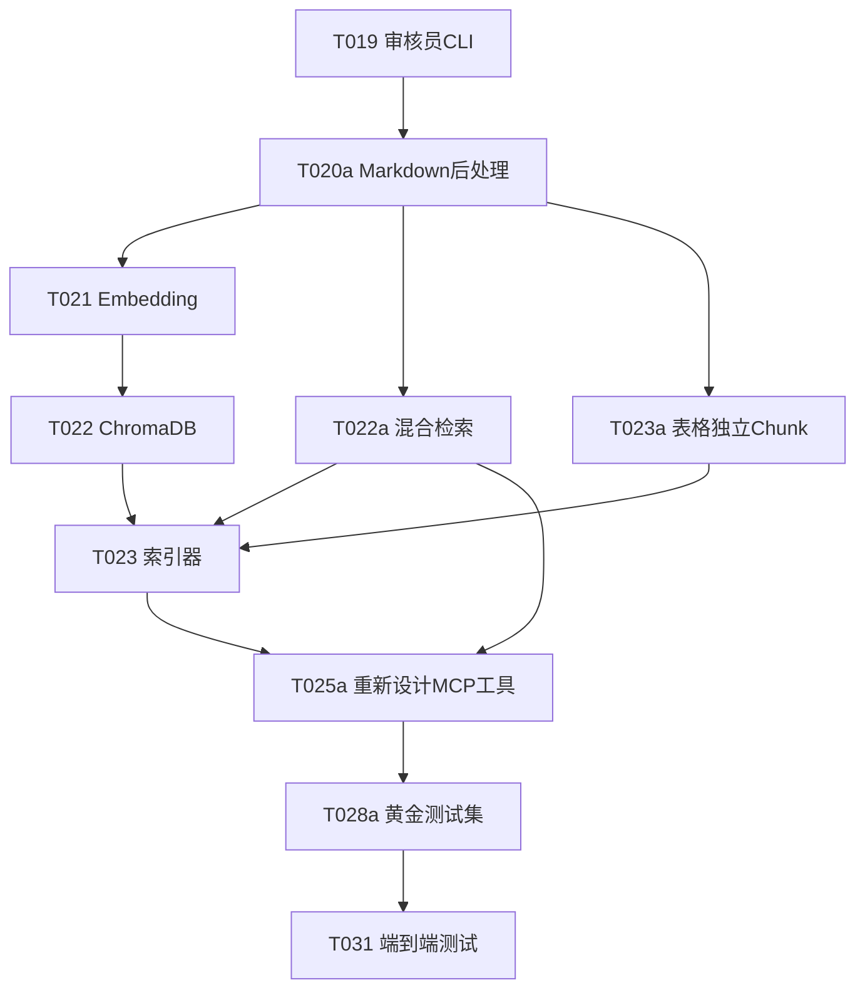

# tasks.md 扩展补丁

## 🎯 使用说明

本文件包含需要添加到 `specs/001-insurance-mcp-core/tasks.md` 中的新任务。
这些任务用于填补第五阶段（向量化索引）的实施gap。

---

## 新增任务：第五阶段扩展

**位置**: 在 `## 第五阶段：AI 客户端检索 (用户故事 1)` 章节中插入以下任务

---

### T020a [US1] Markdown后处理Pipeline

**优先级**: P0 (最高优先级 - 必须在索引前完成)

**目标**: 实现Markdown文档的后处理清洗，优化向量检索效果。

**文件**: `src/parser/markdown/postprocessor.py`

**功能需求**:

1. **脚注内联处理**:
   ```python
   class FootnoteInliner:
       """
       将文档末尾的脚注（名词解释）内联到正文中
       
       示例:
       原文: "被保险人⁽¹⁾应在..."
       脚注: "⁽¹⁾被保险人指受保险合同保障的人"
       处理后: "被保险人（指受保险合同保障的人）应在..."
       """
       def inline_footnotes(self, markdown_text: str) -> str:
           # 1. 提取所有脚注（正则匹配 ⁽数字⁾ 或 [数字]）
           # 2. 在正文中找到脚注引用
           # 3. 将定义插入到引用后
           # 4. 删除文档末尾的脚注部分
           pass
   ```

2. **噪音去除**:
   ```python
   class NoiseRemover:
       """移除页眉、页脚、水印等无用内容"""
       
       NOISE_PATTERNS = [
           r"平安人寿\s*第\s*\d+\s*页",  # 页码
           r"请扫描以查询验证条款",        # 水印
           r"={10,}",                      # 分隔符
           r"保密信息，仅供内部使用"        # 保密标识
       ]
       
       def remove_noise(self, markdown_text: str) -> str:
           # 使用正则表达式移除噪音模式
           pass
   ```

3. **格式标准化**:
   ```python
   class FormatStandardizer:
       """标准化Markdown格式"""
       
       def standardize(self, markdown_text: str) -> str:
           # 1. 统一标题层级（# -> 产品名，## -> 章节，### -> 条款）
           # 2. 统一列表格式（混用 - 和 1. 时统一为 -）
           # 3. 修正繁简混用（"保險人" -> "保险人"）
           # 4. 规范化空白行（章节间保留一个空行）
           pass
   ```

4. **表格验证**:
   ```python
   class TableValidator:
       """验证和标记表格chunk"""
       
       def validate_tables(self, markdown_text: str) -> Tuple[str, List[TableMetadata]]:
           # 1. 检测Markdown表格（| 列 | 格式）
           # 2. 验证行列完整性（header行、分隔行、数据行）
           # 3. 为复杂表格生成JSON结构
           # 4. 返回处理后的文本 + 表格元数据列表
           pass
   ```

**Pipeline集成**:
```python
class MarkdownPostProcessor:
    def __init__(self):
        self.footnote_inliner = FootnoteInliner()
        self.noise_remover = NoiseRemover()
        self.format_standardizer = FormatStandardizer()
        self.table_validator = TableValidator()
    
    def process(self, markdown_path: Path) -> ProcessedMarkdown:
        """执行完整的后处理流程"""
        text = markdown_path.read_text(encoding='utf-8')
        
        # 执行清洗步骤
        text = self.footnote_inliner.inline_footnotes(text)
        text = self.noise_remover.remove_noise(text)
        text = self.format_standardizer.standardize(text)
        text, table_metadata = self.table_validator.validate_tables(text)
        
        return ProcessedMarkdown(
            content=text,
            tables=table_metadata,
            processed_at=datetime.now()
        )
```

**CLI命令**:
```bash
# 后处理单个文档
python -m src.cli.manage process postprocess --doc-id 067afcfc

# 批量后处理所有VERIFIED文档
python -m src.cli.manage process postprocess --all
```

**验收标准**:
- [ ] 脚注内联成功率 > 95%（手动抽检10份文档）
- [ ] 噪音去除不影响正文内容（零误杀）
- [ ] 表格完整性验证通过率 100%
- [ ] 处理后的文档仍符合Markdown规范

**依赖**:
- 依赖 T019（审核员CLI），只处理VERIFIED状态的文档
- 为 T023（索引器）提供清洗后的输入

**测试用例**:
```python
def test_footnote_inliner():
    input_text = "被保险人⁽¹⁾应在...\n\n⁽¹⁾被保险人指受保险合同保障的人"
    expected = "被保险人（指受保险合同保障的人）应在..."
    assert FootnoteInliner().inline_footnotes(input_text) == expected

def test_table_validator():
    input_table = """
    | 保单年度 | 金额 |
    |---------|------|
    | 第5年   | 1000 |
    """
    text, metadata = TableValidator().validate_tables(input_table)
    assert len(metadata) == 1
    assert metadata[0].is_valid == True
    assert metadata[0].rows == 1
    assert metadata[0].columns == 2
```

---

### T022a [US1] 混合检索实现

**优先级**: P0 (CRITICAL - 响应Constitution 4.1要求)

**目标**: 实现语义检索（Dense Vector）与关键词检索（BM25）的混合模式。

**文件**: 
- `src/indexing/vector_store/hybrid_retriever.py`
- `src/indexing/vector_store/bm25_index.py`

**架构设计**:

```python
# bm25_index.py
from rank_bm25 import BM25Okapi
import pickle

class BM25Index:
    """
    BM25关键词检索索引
    
    用于精确匹配专有名词（如"189号"、"减额交清"、"犹豫期"）
    """
    
    def __init__(self, index_path: Path):
        self.index_path = index_path
        self.corpus = []  # 文档列表
        self.doc_ids = []  # 文档ID列表
        self.bm25 = None
        
    def build(self, documents: List[Document]):
        """构建BM25索引"""
        self.corpus = [doc.content for doc in documents]
        self.doc_ids = [doc.id for doc in documents]
        
        # 分词（简单版本：按空格+标点分词）
        tokenized_corpus = [self._tokenize(doc) for doc in self.corpus]
        
        # 构建BM25索引
        self.bm25 = BM25Okapi(tokenized_corpus)
        
        # 持久化
        self._save()
    
    def _tokenize(self, text: str) -> List[str]:
        """分词（支持中文）"""
        import jieba
        return list(jieba.cut(text))
    
    def search(self, query: str, top_k: int = 10) -> List[SearchResult]:
        """BM25检索"""
        tokenized_query = self._tokenize(query)
        scores = self.bm25.get_scores(tokenized_query)
        
        # 获取top-k结果
        top_indices = np.argsort(scores)[::-1][:top_k]
        
        results = []
        for idx in top_indices:
            if scores[idx] > 0:  # 过滤零分结果
                results.append(SearchResult(
                    doc_id=self.doc_ids[idx],
                    content=self.corpus[idx],
                    score=scores[idx],
                    method="BM25"
                ))
        
        return results
    
    def _save(self):
        """保存索引到磁盘"""
        with open(self.index_path, 'wb') as f:
            pickle.dump({
                'corpus': self.corpus,
                'doc_ids': self.doc_ids,
                'bm25': self.bm25
            }, f)
    
    @classmethod
    def load(cls, index_path: Path):
        """从磁盘加载索引"""
        instance = cls(index_path)
        with open(index_path, 'rb') as f:
            data = pickle.load(f)
            instance.corpus = data['corpus']
            instance.doc_ids = data['doc_ids']
            instance.bm25 = data['bm25']
        return instance


# hybrid_retriever.py
class HybridRetriever:
    """
    混合检索器
    
    结合ChromaDB（语义）和BM25（关键词）的检索结果
    """
    
    def __init__(self, chroma_client, bm25_index: BM25Index):
        self.chroma = chroma_client
        self.bm25 = bm25_index
        
    def search(
        self, 
        query: str, 
        top_k: int = 10,
        semantic_weight: float = 0.6,
        bm25_weight: float = 0.4,
        filters: Optional[Dict] = None
    ) -> List[SearchResult]:
        """
        混合检索
        
        Args:
            query: 查询文本
            top_k: 返回结果数
            semantic_weight: 语义检索权重（默认0.6）
            bm25_weight: BM25权重（默认0.4）
            filters: metadata过滤条件（如 {"category": "Exclusion"}）
        """
        
        # 自动调整权重（启发式规则）
        if self._contains_numbers(query):
            # 查询包含数字（如"1.2.1条款"），提升BM25权重
            semantic_weight, bm25_weight = 0.2, 0.8
        elif self._is_question(query):
            # 查询是问句（如"如何退保？"），提升语义权重
            semantic_weight, bm25_weight = 0.8, 0.2
        
        # 1. 语义检索
        semantic_results = self.chroma.query(
            query_texts=[query],
            n_results=top_k * 2,  # 检索2倍结果用于融合
            where=filters
        )
        
        # 2. BM25检索
        bm25_results = self.bm25.search(query, top_k=top_k * 2)
        
        # 3. Reciprocal Rank Fusion (RRF)
        fused_results = self._reciprocal_rank_fusion(
            semantic_results,
            bm25_results,
            semantic_weight,
            bm25_weight
        )
        
        return fused_results[:top_k]
    
    def _reciprocal_rank_fusion(
        self, 
        semantic_results: List, 
        bm25_results: List,
        w1: float,
        w2: float,
        k: int = 60
    ) -> List[SearchResult]:
        """
        RRF算法融合两个排序列表
        
        公式: score(d) = w1 * 1/(k + rank1(d)) + w2 * 1/(k + rank2(d))
        """
        scores = defaultdict(float)
        
        # 语义检索结果
        for rank, result in enumerate(semantic_results, start=1):
            doc_id = result['id']
            scores[doc_id] += w1 / (k + rank)
        
        # BM25结果
        for rank, result in enumerate(bm25_results, start=1):
            doc_id = result.doc_id
            scores[doc_id] += w2 / (k + rank)
        
        # 按分数排序
        sorted_docs = sorted(scores.items(), key=lambda x: x[1], reverse=True)
        
        # 构建最终结果
        final_results = []
        for doc_id, score in sorted_docs:
            # 获取文档内容（从ChromaDB或BM25）
            doc = self._get_document(doc_id)
            final_results.append(SearchResult(
                doc_id=doc_id,
                content=doc.content,
                score=score,
                method="Hybrid (RRF)"
            ))
        
        return final_results
    
    def _contains_numbers(self, query: str) -> bool:
        """检查查询是否包含数字（如"1.2.1"）"""
        return bool(re.search(r'\d+\.\d+', query))
    
    def _is_question(self, query: str) -> bool:
        """检查查询是否为问句"""
        question_words = ['如何', '怎么', '什么', '为什么', '哪', '多少', '吗', '呢', '?', '？']
        return any(word in query for word in question_words)
```

**CLI命令**:
```bash
# 构建BM25索引（在构建ChromaDB索引时同步执行）
python -m src.cli.manage index --rebuild

# 测试混合检索
python -m src.cli.manage index test-search "1.2.1条款内容" --method hybrid
```

**验收标准**:
- [ ] 专有名词查询（如"189号"）BM25权重自动提升至80%
- [ ] 问句查询（如"如何退保？"）语义权重自动提升至80%
- [ ] 混合检索比纯语义检索准确率提升 > 15%（使用黄金测试集验证）
- [ ] 响应时间 < 2秒

**依赖**:
- 依赖 T020a（后处理）提供清洗后的文本
- 依赖 T022（ChromaDB实现）
- 新增Python依赖：`rank-bm25`, `jieba`（中文分词）

**测试用例**:
```python
@pytest.mark.asyncio
async def test_hybrid_search_with_numbers():
    """测试包含数字的查询自动提升BM25权重"""
    retriever = HybridRetriever(chroma_client, bm25_index)
    results = retriever.search("1.2.1条款")
    
    # 验证第一个结果确实包含"1.2.1"
    assert "1.2.1" in results[0].content

@pytest.mark.asyncio
async def test_hybrid_search_question():
    """测试问句查询自动提升语义权重"""
    retriever = HybridRetriever(chroma_client, bm25_index)
    results = retriever.search("如何申请退保？")
    
    # 验证结果包含退保相关条款
    assert any("退保" in r.content for r in results)
```

---

### T023a [US1] 表格独立Chunk处理

**优先级**: P0 (CRITICAL - 响应Constitution 3.2要求)

**目标**: 确保表格作为独立chunk存储，防止行列关系崩坏。

**文件**: `src/indexing/chunker.py` (扩展现有实现)

**实现逻辑**:

```python
class SemanticChunker:
    """
    语义感知的Chunk生成器
    
    基于Markdown标题层级切分，特殊处理表格
    """
    
    def __init__(
        self,
        target_size: int = 512,
        max_size: int = 1024,
        overlap: int = 100,
        enable_table_protection: bool = True
    ):
        self.target_size = target_size
        self.max_size = max_size
        self.overlap = overlap
        self.enable_table_protection = enable_table_protection
        
    def chunk_document(self, markdown_text: str, doc_id: str) -> List[PolicyChunk]:
        """
        切分文档为chunks
        
        流程:
        1. 识别所有表格位置
        2. 提取表格作为独立chunks
        3. 对非表格部分按标题层级切分
        4. 合并结果
        """
        chunks = []
        
        # 1. 识别并提取表格
        table_chunks = []
        if self.enable_table_protection:
            markdown_text, table_chunks = self._extract_tables(markdown_text, doc_id)
        
        # 2. 对剩余文本按标题层级切分
        text_chunks = self._split_by_headers(markdown_text, doc_id)
        
        # 3. 合并并排序（按原文顺序）
        all_chunks = sorted(
            table_chunks + text_chunks,
            key=lambda c: c.chunk_index
        )
        
        return all_chunks
    
    def _extract_tables(
        self, 
        markdown_text: str, 
        doc_id: str
    ) -> Tuple[str, List[PolicyChunk]]:
        """
        提取表格并转换为独立chunks
        
        Returns:
            (去除表格后的文本, 表格chunks列表)
        """
        table_chunks = []
        table_pattern = r'\|[^\n]+\|\n\|[-:| ]+\|\n(\|[^\n]+\|\n)+'
        
        for match in re.finditer(table_pattern, markdown_text):
            table_md = match.group(0)
            start_pos = match.start()
            
            # 提取表格前的标题作为上下文
            context = self._get_table_context(markdown_text, start_pos)
            
            # 解析表格为JSON
            table_data = self._parse_table_to_json(table_md)
            
            # 创建表格chunk
            chunk = PolicyChunk(
                id=f"{doc_id}_table_{len(table_chunks)}",
                document_id=doc_id,
                content=f"{context}\n\n{table_md}",  # 包含上下文
                is_table=True,
                table_data=table_data,
                metadata={
                    "table_type": self._infer_table_type(context),
                    "rows": table_data["row_count"],
                    "columns": table_data["column_count"]
                },
                chunk_index=start_pos  # 用于排序
            )
            table_chunks.append(chunk)
        
        # 从原文本中移除表格（用占位符替换，保持位置）
        cleaned_text = re.sub(table_pattern, "[TABLE_PLACEHOLDER]", markdown_text)
        
        return cleaned_text, table_chunks
    
    def _parse_table_to_json(self, table_md: str) -> Dict:
        """
        解析Markdown表格为JSON结构
        
        示例:
        Input:
        | 保单年度 | 金额 |
        |---------|------|
        | 第5年   | 1000 |
        
        Output:
        {
            "headers": ["保单年度", "金额"],
            "rows": [["第5年", "1000"]],
            "row_count": 1,
            "column_count": 2
        }
        """
        lines = table_md.strip().split('\n')
        headers = [cell.strip() for cell in lines[0].split('|')[1:-1]]
        
        rows = []
        for line in lines[2:]:  # 跳过分隔行
            cells = [cell.strip() for cell in line.split('|')[1:-1]]
            rows.append(cells)
        
        return {
            "headers": headers,
            "rows": rows,
            "row_count": len(rows),
            "column_count": len(headers)
        }
    
    def _get_table_context(self, text: str, table_start_pos: int, lines: int = 3) -> str:
        """获取表格前的几行作为上下文（通常是表格标题）"""
        before_text = text[:table_start_pos]
        context_lines = before_text.split('\n')[-lines:]
        return '\n'.join(context_lines)
    
    def _infer_table_type(self, context: str) -> str:
        """根据上下文推断表格类型"""
        type_keywords = {
            "减额交清": "减额交清对比表",
            "现金价值": "现金价值表",
            "费率": "费率表",
            "利益": "利益演示表"
        }
        for keyword, table_type in type_keywords.items():
            if keyword in context:
                return table_type
        return "未知表格"
    
    def _split_by_headers(self, text: str, doc_id: str) -> List[PolicyChunk]:
        """
        按Markdown标题层级切分文本
        
        使用LangChain的MarkdownHeaderTextSplitter或自实现
        """
        from langchain.text_splitter import MarkdownHeaderTextSplitter
        
        headers_to_split_on = [
            ("#", "产品名称"),
            ("##", "章节"),
            ("###", "条款"),
        ]
        
        splitter = MarkdownHeaderTextSplitter(headers_to_split_on)
        splits = splitter.split_text(text)
        
        chunks = []
        for i, split in enumerate(splits):
            # 提取metadata
            section_id = self._extract_section_id(split.metadata)
            category = self._classify_category(split.page_content)
            
            chunk = PolicyChunk(
                id=f"{doc_id}_text_{i}",
                document_id=doc_id,
                content=split.page_content,
                is_table=False,
                metadata={
                    "section_id": section_id,
                    "section_title": split.metadata.get("条款", ""),
                    "category": category,
                    "level": len([h for h in headers_to_split_on if h[1] in split.metadata])
                },
                chunk_index=i * 1000  # 简单排序，表格会插入到正确位置
            )
            chunks.append(chunk)
        
        return chunks
```

**验收标准**:
- [ ] 表格chunk的 `is_table=True` 标记准确率 100%
- [ ] 表格JSON结构完整性（行列完整）100%
- [ ] 复杂表格（如减额交清表）能正确解析为JSON
- [ ] 表格chunk包含上下文标题（便于理解表格含义）

**依赖**:
- 依赖 T020a（后处理）提供标准化的表格格式
- 新增Python依赖：`langchain`（MarkdownHeaderTextSplitter）

**测试用例**:
```python
def test_table_extraction():
    """测试表格提取和JSON转换"""
    markdown = """
    ### 6.4 减额交清对比表
    
    | 保单年度 | 减额后年金 | 备注 |
    |---------|-----------|------|
    | 第5年   | 1000元/年 | 终身领取 |
    | 第10年  | 1500元/年 | 终身领取 |
    """
    
    chunker = SemanticChunker(enable_table_protection=True)
    chunks = chunker.chunk_document(markdown, "test_doc")
    
    # 应该有一个表格chunk
    table_chunks = [c for c in chunks if c.is_table]
    assert len(table_chunks) == 1
    
    # 验证JSON结构
    table_data = table_chunks[0].table_data
    assert table_data["row_count"] == 2
    assert table_data["column_count"] == 3
    assert "减额后年金" in table_data["headers"]
```

---

### T025a [US1] 重新设计MCP工具

**优先级**: P0 (HIGH - 核心用户体验)

**目标**: 根据优化建议重新设计MCP工具，提供更精准的保险条款查询能力。

**文件**:
- `src/mcp_server/tools/search_clause.py` (新建)
- `src/mcp_server/tools/check_exclusion.py` (新建)
- `src/mcp_server/tools/surrender_logic.py` (新建)
- `src/mcp_server/server.py` (更新工具注册)

**实现示例 - Tool 1: search_policy_clause**

```python
# search_clause.py
from mcp.server.models import Tool
from pydantic import BaseModel
from typing import Optional, List

class SearchPolicyClauseInput(BaseModel):
    query: str
    company: Optional[str] = None
    product: Optional[str] = None
    category: Optional[str] = None
    top_k: int = 5

class ClauseResult(BaseModel):
    chunk_id: str
    content: str
    section_id: str
    section_title: str
    similarity_score: float
    source_reference: dict

async def search_policy_clause(input: SearchPolicyClauseInput) -> List[ClauseResult]:
    """
    语义条款检索工具
    
    使用混合检索（语义+关键词）查找保险条款
    """
    # 构建metadata过滤器
    filters = {}
    if input.company:
        filters["company"] = input.company
    if input.product:
        filters["product_name"] = input.product
    if input.category:
        filters["category"] = input.category
    
    # 使用混合检索器
    from src.indexing.vector_store.hybrid_retriever import get_hybrid_retriever
    retriever = get_hybrid_retriever()
    
    results = await retriever.search(
        query=input.query,
        top_k=input.top_k,
        filters=filters if filters else None
    )
    
    # 过滤低相似度结果
    filtered_results = [r for r in results if r.similarity_score > 0.7]
    
    # 转换为ClauseResult
    clause_results = []
    for result in filtered_results:
        # 从数据库获取完整metadata
        doc = get_document_by_chunk_id(result.chunk_id)
        
        clause_results.append(ClauseResult(
            chunk_id=result.chunk_id,
            content=result.content,
            section_id=result.metadata.get("section_id", ""),
            section_title=result.metadata.get("section_title", ""),
            similarity_score=result.similarity_score,
            source_reference={
                "product_name": doc.product.name,
                "document_type": doc.doc_type,
                "pdf_path": doc.local_path,
                "page_number": result.metadata.get("page_number"),
                "download_url": doc.url
            }
        ))
    
    return clause_results

# MCP Tool定义
search_policy_clause_tool = Tool(
    name="search_policy_clause",
    description="搜索保险条款，支持自然语言查询和精确过滤",
    inputSchema=SearchPolicyClauseInput.schema()
)
```

**实现示例 - Tool 2: check_exclusion_risk**

```python
# check_exclusion.py
class CheckExclusionRiskInput(BaseModel):
    scenario_description: str
    product_id: Optional[str] = None
    strict_mode: bool = True

class ExclusionCheckResult(BaseModel):
    is_excluded: bool
    confidence: float
    matched_clauses: List[ClauseResult]
    risk_summary: str
    disclaimer: str = "本结果仅供参考，实际理赔以保险合同和公司审核为准"

async def check_exclusion_risk(input: CheckExclusionRiskInput) -> ExclusionCheckResult:
    """
    免责条款核查工具
    
    专门检索免责条款，判断特定场景是否被排除
    """
    # 1. 关键词扩展（增强召回率）
    expanded_query = expand_exclusion_keywords(input.scenario_description)
    # 例如: "酒驾" -> ["酒后驾驶", "饮酒", "醉酒", "酒精影响"]
    
    # 2. 强制过滤category="Exclusion"
    results = await search_policy_clause(SearchPolicyClauseInput(
        query=expanded_query,
        product_id=input.product_id,
        category="Exclusion",
        top_k=10
    ))
    
    # 3. 判断是否明确免责
    is_excluded = False
    confidence = 0.0
    
    if results:
        # 使用LLM进行二次判断（可选）
        is_excluded, confidence = await llm_judge_exclusion(
            scenario=input.scenario_description,
            clauses=[r.content for r in results]
        )
    
    # 4. 生成风险总结
    risk_summary = generate_risk_summary(
        is_excluded=is_excluded,
        matched_clauses=results
    )
    
    return ExclusionCheckResult(
        is_excluded=is_excluded,
        confidence=confidence,
        matched_clauses=results,
        risk_summary=risk_summary
    )

def expand_exclusion_keywords(scenario: str) -> str:
    """扩展免责场景的关键词"""
    keyword_map = {
        "酒驾": ["酒后驾驶", "饮酒", "醉酒", "酒精"],
        "吸毒": ["毒品", "吸食毒品", "注射毒品", "麻醉药品"],
        "自杀": ["自杀", "自残", "自伤"],
        # ... 更多映射
    }
    
    for key, expansions in keyword_map.items():
        if key in scenario:
            return " OR ".join(expansions)
    
    return scenario
```

**实现示例 - Tool 3: calculate_surrender_value_logic**

```python
# surrender_logic.py
class CalculateSurrenderValueLogicInput(BaseModel):
    product_id: str
    policy_year: Optional[int] = None
    operation: str  # "surrender" 或 "reduced_paid_up"

class SurrenderLogicResult(BaseModel):
    operation_name: str
    definition: str
    calculation_rules: List[str]
    conditions: List[str]
    consequences: List[str]
    related_tables: List[dict]
    comparison_note: str
    source_references: List[dict]

async def calculate_surrender_value_logic(
    input: CalculateSurrenderValueLogicInput
) -> SurrenderLogicResult:
    """
    退保/减额交清逻辑提取工具
    
    同时返回退保和减额交清的条款，便于对比
    """
    # 1. 检索退保条款
    surrender_clauses = await search_policy_clause(SearchPolicyClauseInput(
        query="退保 现金价值",
        product_id=input.product_id,
        category="Process",
        top_k=3
    ))
    
    # 2. 检索减额交清条款
    reduced_clauses = await search_policy_clause(SearchPolicyClauseInput(
        query="减额交清",
        product_id=input.product_id,
        category="Process",
        top_k=3
    ))
    
    # 3. 检索相关表格
    table_chunks = await search_table_chunks(
        product_id=input.product_id,
        table_types=["现金价值表", "减额交清对比表"]
    )
    
    # 4. 提取结构化信息
    operation_name = "退保" if input.operation == "surrender" else "减额交清"
    
    definition = extract_definition(
        surrender_clauses if input.operation == "surrender" else reduced_clauses
    )
    
    calculation_rules = extract_calculation_rules(definition)
    conditions = extract_conditions(definition)
    consequences = extract_consequences(definition)
    
    # 5. 生成对比说明
    comparison_note = (
        "退保：一次性拿回现金价值，但失去保障。\n"
        "减额交清：不拿钱、不交钱，保障缩水但合同继续有效。"
    )
    
    # 6. 添加缺失提示
    if not any("现金价值表" in t["type"] for t in table_chunks):
        calculation_rules.append(
            "⚠️ 具体金额需查阅保单附带的现金价值表"
        )
    
    return SurrenderLogicResult(
        operation_name=operation_name,
        definition=definition,
        calculation_rules=calculation_rules,
        conditions=conditions,
        consequences=consequences,
        related_tables=table_chunks,
        comparison_note=comparison_note,
        source_references=[c.source_reference for c in surrender_clauses + reduced_clauses]
    )
```

**MCP Server集成**:
```python
# server.py
from mcp.server.stdio import stdio_server
from src.mcp_server.tools import (
    search_policy_clause_tool,
    check_exclusion_risk_tool,
    calculate_surrender_value_logic_tool
)

app = Server("insurance-mcp")

# 注册工具
@app.list_tools()
async def list_tools():
    return [
        search_policy_clause_tool,
        check_exclusion_risk_tool,
        calculate_surrender_value_logic_tool
    ]

@app.call_tool()
async def call_tool(name: str, arguments: dict):
    if name == "search_policy_clause":
        return await search_policy_clause(SearchPolicyClauseInput(**arguments))
    elif name == "check_exclusion_risk":
        return await check_exclusion_risk(CheckExclusionRiskInput(**arguments))
    elif name == "calculate_surrender_value_logic":
        return await calculate_surrender_value_logic(CalculateSurrenderValueLogicInput(**arguments))
    else:
        raise ValueError(f"Unknown tool: {name}")
```

**验收标准**:
- [ ] 3个工具都能正确响应并返回结构化结果
- [ ] `check_exclusion_risk` 的免责条款召回率 > 95%
- [ ] `calculate_surrender_value_logic` 能同时返回退保和减额交清信息
- [ ] 所有工具返回结果都包含完整的 `source_reference`

**依赖**:
- 依赖 T022a（混合检索）
- 依赖 T023a（表格处理）
- 依赖 T023（ChromaDB索引）

---

### T028a [US1] 黄金测试集构建

**优先级**: P1 (MEDIUM - 质量保证)

**目标**: 构建包含50个标准保险问题的黄金测试集，用于持续评估检索质量。

**文件**: `tests/golden_dataset/insurance_qa_golden.json`

**数据结构**:
```json
{
  "version": "1.0",
  "created_at": "2025-11-21",
  "total_questions": 50,
  "categories": {
    "basic": 20,
    "comparison": 15,
    "exclusion": 15
  },
  "questions": [
    {
      "id": "Q001",
      "category": "basic",
      "question": "平安福耀年金保险的保险期间是多久？",
      "ground_truth": {
        "section_id": "1.4",
        "section_title": "保险期间",
        "expected_keywords": ["保险期间", "合同生效之日", "保险期满"],
        "product_name": "平安福耀年金保险（分红型）"
      },
      "acceptance_criteria": {
        "must_appear_in_top": 1,
        "min_similarity_score": 0.85
      }
    },
    {
      "id": "Q015",
      "category": "comparison",
      "question": "减额交清和退保有什么区别？哪个更划算？",
      "ground_truth": {
        "section_ids": ["6.4", "5.2"],
        "section_titles": ["减额交清", "退保"],
        "expected_keywords": ["减额交清", "退保", "现金价值", "保额减少"],
        "product_name": "平安福耀年金保险（分红型）"
      },
      "acceptance_criteria": {
        "must_appear_in_top": 3,
        "all_sections_present": true,
        "min_similarity_score": 0.75
      }
    },
    {
      "id": "Q030",
      "category": "exclusion",
      "question": "如果被保险人酒后驾驶摩托车出事，保险公司赔吗？",
      "ground_truth": {
        "section_id": "2.1",
        "section_title": "责任免除",
        "expected_keywords": ["酒后驾驶", "醉酒", "饮酒", "免责"],
        "is_exclusion": true,
        "product_name": "平安福耀年金保险（分红型）"
      },
      "acceptance_criteria": {
        "must_appear_in_top": 1,
        "category_filter": "Exclusion",
        "min_similarity_score": 0.90
      }
    }
  ]
}
```

**测试脚本**:
```python
# tests/golden_dataset/test_retrieval_quality.py
import json
import pytest
from src.mcp_server.tools.search_clause import search_policy_clause

class TestGoldenDataset:
    @pytest.fixture
    def golden_data(self):
        with open("tests/golden_dataset/insurance_qa_golden.json") as f:
            return json.load(f)
    
    @pytest.mark.asyncio
    async def test_basic_queries(self, golden_data):
        """测试基础查询类问题"""
        basic_questions = [q for q in golden_data["questions"] if q["category"] == "basic"]
        
        passed = 0
        for q in basic_questions:
            results = await search_policy_clause(SearchPolicyClauseInput(
                query=q["question"],
                product=q["ground_truth"]["product_name"],
                top_k=5
            ))
            
            # 检查ground truth是否在top-1
            if results and results[0].section_id == q["ground_truth"]["section_id"]:
                passed += 1
            
            # 检查相似度阈值
            if results and results[0].similarity_score >= q["acceptance_criteria"]["min_similarity_score"]:
                passed += 0.5  # 部分分
        
        accuracy = passed / len(basic_questions)
        assert accuracy >= 0.90, f"Basic query accuracy {accuracy} < 0.90"
    
    @pytest.mark.asyncio
    async def test_comparison_queries(self, golden_data):
        """测试对比查询类问题"""
        comparison_questions = [q for q in golden_data["questions"] if q["category"] == "comparison"]
        
        passed = 0
        for q in comparison_questions:
            results = await search_policy_clause(SearchPolicyClauseInput(
                query=q["question"],
                product=q["ground_truth"]["product_name"],
                top_k=5
            ))
            
            # 检查是否包含所有相关section
            returned_sections = {r.section_id for r in results[:3]}
            expected_sections = set(q["ground_truth"]["section_ids"])
            
            if expected_sections.issubset(returned_sections):
                passed += 1
        
        accuracy = passed / len(comparison_questions)
        assert accuracy >= 0.85, f"Comparison query accuracy {accuracy} < 0.85"
    
    @pytest.mark.asyncio
    async def test_exclusion_queries(self, golden_data):
        """测试免责条款查询"""
        exclusion_questions = [q for q in golden_data["questions"] if q["category"] == "exclusion"]
        
        passed = 0
        for q in exclusion_questions:
            results = await search_policy_clause(SearchPolicyClauseInput(
                query=q["question"],
                product=q["ground_truth"]["product_name"],
                category="Exclusion",
                top_k=5
            ))
            
            # 检查返回的都是免责条款
            all_exclusion = all(r.metadata["category"] == "Exclusion" for r in results)
            
            # 检查是否包含ground truth
            contains_truth = any(r.section_id == q["ground_truth"]["section_id"] for r in results)
            
            if all_exclusion and contains_truth:
                passed += 1
        
        recall = passed / len(exclusion_questions)
        assert recall >= 0.95, f"Exclusion recall {recall} < 0.95"
```

**黄金数据集构建流程**:

1. **初始种子问题**（人工编写）：
   - 从平安福耀年金保险条款中提取20个典型问题
   - 涵盖保险期间、保险金、免责、退保等核心主题

2. **问题扩展**（半自动）：
   - 使用LLM生成变体问题（改写、同义替换）
   - 人工审核并标注正确答案

3. **真实用户问题收集**（未来）：
   - 从MCP服务器日志中收集真实查询
   - 人工标注并补充到黄金集

**验收标准**:
- [ ] 黄金测试集包含 ≥ 50个问题
- [ ] 基础查询准确率 ≥ 90%
- [ ] 对比查询准确率 ≥ 85%
- [ ] 免责查询召回率 ≥ 95%
- [ ] 每月运行一次，记录趋势

**依赖**:
- 依赖所有前置任务（T020a ~ T025a）
- 用于持续质量监控

---

## 任务依赖关系图（更新）



---

## CLI命令更新建议

```bash
# 添加到 src/cli/manage.py

# 后处理命令组
python -m src.cli.manage process postprocess --doc-id <id>  # T020a
python -m src.cli.manage process postprocess --all          # T020a

# 索引命令（扩展）
python -m src.cli.manage index --rebuild --enable-bm25      # T022a
python -m src.cli.manage index test-search "<query>" --method hybrid  # T022a

# 测试命令组
python -m src.cli.manage test golden --category basic       # T028a
python -m src.cli.manage test golden --category comparison  # T028a
python -m src.cli.manage test golden --category exclusion   # T028a
python -m src.cli.manage test golden --all --report         # T028a
```

---

## 实施检查清单

在开始第五阶段实施前，确认以下准备工作：

- [ ] 已完成第四阶段所有任务（T015-T019）
- [ ] 已有 ≥ 20份 VERIFIED 状态的文档
- [ ] Python环境已安装新依赖：`rank-bm25`, `jieba`, `langchain`
- [ ] 已阅读并理解用户提供的优化建议
- [ ] spec.md 已更新（应用 SPEC_OPTIMIZATION_PATCH.md）
- [ ] data-model.md 已更新（应用 DATA_MODEL_PATCH.md）
- [ ] 团队已对新的MCP工具设计达成共识

---

**任务扩展完成。预计新增工作量：15-20工作日。**

