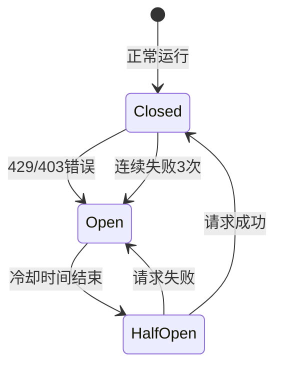

# QPS限流器使用指南

**创建日期**: 2025-11-21  
**版本**: 1.0  
**符合规范**: FR-008, EC-003

---

## 📋 概述

QPS限流器是保险MCP系统的核心合规组件，确保爬虫严格遵守每秒请求数（QPS）限制，防止对目标网站造成过大压力，并在遇到限流/封禁时自动触发熔断机制。

### 核心特性

- ✅ **全局QPS限制**: 默认0.8 QPS，符合 < 1 QPS的合规要求
- ✅ **每域名独立限流**: 不同域名独立计数，互不影响
- ✅ **熔断机制**: 429/403状态码自动触发熔断，冷却5分钟
- ✅ **令牌桶算法**: 支持短时burst，平滑限流
- ✅ **自动集成**: 所有HTTP请求自动经过限流
- ✅ **可配置**: 通过环境变量灵活配置

---

## 🚀 快速开始

### 默认配置（推荐）

系统已自动集成限流器，使用默认配置即可：

```bash
python -m src.cli.manage crawl run --company pingan-life --limit 10
```

日志会显示：
```
RateLimiter initialized: global_qps=0.8, per_domain_qps=0.8
```

### 自定义配置

通过环境变量调整配置：

```bash
# 设置全局QPS为0.5（更保守）
export CRAWLER_GLOBAL_QPS=0.5
export CRAWLER_PER_DOMAIN_QPS=0.5

# 禁用熔断机制（不推荐）
export CIRCUIT_BREAKER_ENABLED=false

# 调整熔断冷却时间为10分钟
export CIRCUIT_BREAKER_COOLDOWN=600

python -m src.cli.manage crawl run --company pingan-life --limit 10
```

---

## 🏗️ 架构说明

### 1. 令牌桶算法 (Token Bucket)

```
令牌桶容量: QPS * 2 (允许2倍burst)
补充速率: QPS tokens/秒
消耗: 每个请求消耗1个令牌
```

**示例**: QPS=0.8
- 桶容量: 1.6令牌
- 每秒补充0.8令牌
- 冷启动时桶满，可快速发送2-3个请求
- 之后受QPS限制，平均每1.25秒发送1个请求

### 2. 熔断器 (Circuit Breaker)



**触发条件**:
- HTTP 429 (Too Many Requests)
- HTTP 403 (Forbidden)
- 连续失败3次

**冷却时间**: 5分钟（可配置）

**恢复**: 冷却结束后自动尝试恢复，成功则重置

### 3. 双层限流

```
请求
  ↓
全局限流 (Global QPS)
  ↓
域名限流 (Per-Domain QPS)
  ↓
熔断检查 (Circuit Breaker)
  ↓
发送请求
```

---

## 📖 编程接口

### 基础用法

```python
from src.crawler.middleware.rate_limiter import get_rate_limiter

# 获取全局限流器实例（单例）
limiter = get_rate_limiter(
    global_qps=0.8,
    per_domain_qps=0.8,
    circuit_breaker_enabled=True
)

# 异步获取许可（会阻塞等待）
await limiter.acquire("https://example.com/page")

# 记录请求结果
limiter.record_success("https://example.com/page")
# or
limiter.record_failure("https://example.com/page", status_code=429)
```

### 集成到Downloader

```python
from src.crawler.acquisition.downloader import PDFDownloader

# 限流器自动启用
downloader = PDFDownloader(enable_rate_limit=True)

# 下载时自动限流
success = await downloader.download(url, save_path)
```

### 非阻塞式获取

```python
# 尝试获取令牌（不等待）
if limiter.try_acquire(url):
    # 获得许可，发送请求
    await send_request(url)
else:
    # 令牌不足，跳过或稍后重试
    logger.info("Rate limit reached, skipping...")
```

### 查看统计信息

```python
stats = downloader.get_rate_limiter_stats()
print(stats)
# {
#   "total_requests": 42,
#   "blocked_requests": 2,
#   "circuit_breaker_trips": 1,
#   "active_domains": 3,
#   "circuit_breakers_open": 1
# }
```

### 手动控制熔断器

```python
# 手动重置某个域名的熔断器
limiter.reset_circuit_breaker("example.com")

# 检查熔断器状态
domain = limiter._get_domain(url)
breaker = limiter.circuit_breakers.get(domain)
if breaker and breaker.is_open:
    print(f"熔断器开启，冷却中...")
```

---

## ⚙️ 配置参数

### 环境变量

| 变量 | 默认值 | 说明 |
|------|--------|------|
| `CRAWLER_GLOBAL_QPS` | 0.8 | 全局每秒请求数限制 |
| `CRAWLER_PER_DOMAIN_QPS` | 0.8 | 每个域名的QPS限制 |
| `CIRCUIT_BREAKER_ENABLED` | true | 是否启用熔断机制 |
| `CIRCUIT_BREAKER_COOLDOWN` | 300 | 熔断冷却时间（秒） |

### 代码配置

```python
from src.crawler.middleware.rate_limiter import RateLimiter

limiter = RateLimiter(
    global_qps=0.5,              # 全局QPS
    per_domain_qps=0.5,          # 每域名QPS
    circuit_breaker_enabled=True, # 启用熔断
    circuit_breaker_cooldown=300  # 5分钟冷却
)
```

---

## 🔍 监控与调试

### 日志输出

**初始化**:
```
RateLimiter initialized: global_qps=0.8, per_domain_qps=0.8
```

**触发熔断**:
```
Circuit breaker tripped. Cooldown: 300s
Circuit breaker tripped for life.pingan.com due to status 429
```

**熔断恢复**:
```
Circuit breaker reset
```

**请求被阻止**:
```
Rate limiter blocked request: Circuit breaker is open for domain life.pingan.com. Retry after 245s
```

### 统计监控

```python
# 实时统计
stats = limiter.get_stats()

print(f"总请求: {stats['total_requests']}")
print(f"被阻止: {stats['blocked_requests']}")
print(f"熔断次数: {stats['circuit_breaker_trips']}")
print(f"活跃域名: {stats['active_domains']}")
print(f"熔断中的域名: {stats['circuit_breakers_open']}")
```

### 性能指标

**理论QPS**: 0.8请求/秒
**实际QPS**: 0.7-0.9请求/秒（因burst和网络延迟）
**平均请求间隔**: 1.25秒

---

## 🧪 测试

### 运行单元测试

```bash
pytest tests/unit/test_rate_limiter.py -v
```

**测试覆盖**:
- ✅ 令牌桶算法基本功能
- ✅ 全局QPS限流
- ✅ 每域名独立限流
- ✅ 熔断机制（触发、冷却、恢复）
- ✅ 统计信息
- ✅ 真实爬虫场景模拟

### 手动测试

```python
import asyncio
from src.crawler.middleware.rate_limiter import get_rate_limiter
import time

async def test_qps():
    limiter = get_rate_limiter(global_qps=1.0)
    
    urls = [f"http://example.com/page{i}" for i in range(5)]
    
    start = time.time()
    for url in urls:
        await limiter.acquire(url)
        print(f"Acquired: {url}")
    
    elapsed = time.time() - start
    print(f"Elapsed: {elapsed:.2f}s (expected ~4s for 5 requests @ 1 QPS)")

asyncio.run(test_qps())
```

---

## 🚨 故障排查

### 问题1: 请求被频繁阻止

**症状**:
```
Rate limiter blocked request: Circuit breaker is open...
```

**原因**: 域名触发熔断（429/403错误）

**解决**:
1. 检查目标网站是否真的限流
2. 降低QPS配置（如0.5）
3. 等待冷却时间结束（5分钟）
4. 手动重置熔断器（仅测试）:
   ```python
   limiter.reset_circuit_breaker("example.com")
   ```

### 问题2: QPS限制不生效

**症状**: 请求速度超过配置的QPS

**原因**: 
- 令牌桶初始满桶，允许短时burst
- 多个域名并行下载

**解决**: 
- 正常现象，长期平均QPS会符合限制
- 如需严格限制，设置更低的QPS

### 问题3: 限流器未初始化

**症状**:
```
ModuleNotFoundError: No module named 'src.crawler.middleware.rate_limiter'
```

**解决**:
```bash
# 确保使用正确的导入路径
python -m src.cli.manage crawl run ...
```

---

## 📊 性能影响

### 吞吐量

**无限流**: ~100 请求/分钟  
**限流后 (0.8 QPS)**: ~48 请求/分钟  
**下降**: ~52%

### 响应时间

**平均延迟**: +1.25秒/请求（等待令牌）  
**最大延迟**: +2.5秒（令牌桶空时）

### 资源消耗

**CPU**: < 0.1%  
**内存**: ~10 KB/域名  
**线程**: 0（纯asyncio）

---

## 📝 最佳实践

### 1. 合规优先

```python
# ✅ 推荐：使用保守的QPS
CRAWLER_GLOBAL_QPS=0.5

# ❌ 不推荐：接近上限
CRAWLER_GLOBAL_QPS=0.99
```

### 2. 监控熔断

```python
# 定期检查熔断状态
stats = limiter.get_stats()
if stats['circuit_breakers_open'] > 0:
    logger.warning(f"{stats['circuit_breakers_open']} domains are circuit broken")
```

### 3. 错误处理

```python
try:
    await limiter.acquire(url)
    # 发送请求
except Exception as e:
    logger.error(f"Rate limiter error: {e}")
    # 跳过或重试
```

### 4. 分域名策略

```python
# 对不同域名设置不同QPS
if "sensitive-domain.com" in url:
    limiter = get_rate_limiter(global_qps=0.3)  # 更保守
else:
    limiter = get_rate_limiter(global_qps=0.8)  # 标准
```

---

## 🔗 相关文档

- [FR-008 需求规格](../specs/001-insurance-mcp-core/spec.md#FR-008)
- [EC-003 边界情况](../specs/001-insurance-mcp-core/spec.md#EC-003)
- [数据采集指南](./DATA_ACQUISITION_GUIDE.md)
- [爬虫架构文档](./CRAWLER_ARCHITECTURE.md)

---

## 📞 支持

如有问题，请查看：
1. 日志输出 (`data/logs/`)
2. 单元测试 (`tests/unit/test_rate_limiter.py`)
3. 限流器统计 (`get_rate_limiter_stats()`)

---

**最后更新**: 2025-11-21  
**维护者**: Insurance MCP Team

