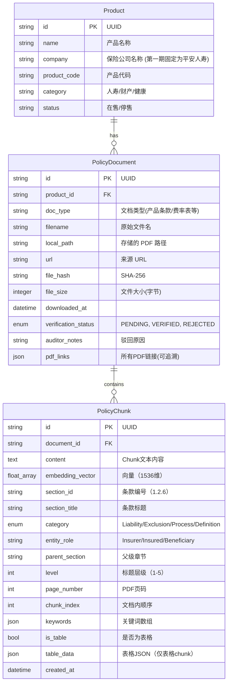

# 数据模型：保险 MCP 核心平台

**功能分支**: `001-insurance-mcp-core`
**最后更新**: 2025-11-21
**第一期范围**: 仅支持平安人寿公司数据，company 字段固定为 "平安人寿"

## 实体关系图 (概念)



## 模式定义

### SQLite 模式 (元数据存储)

```sql
CREATE TABLE products (
    id TEXT PRIMARY KEY,
    name TEXT NOT NULL,
    company TEXT NOT NULL DEFAULT '平安人寿', -- 第一期固定为平安人寿
    product_code TEXT UNIQUE, -- 产品代码，用于去重
    category TEXT,
    created_at TIMESTAMP DEFAULT CURRENT_TIMESTAMP
);

CREATE TABLE policy_documents (
    id TEXT PRIMARY KEY,
    product_id TEXT,
    doc_type TEXT NOT NULL, -- 文档类型：产品条款、费率表、说明书等
    filename TEXT NOT NULL,
    local_path TEXT NOT NULL,
    url TEXT,
    file_hash TEXT, -- SHA-256哈希，用于去重
    file_size INTEGER, -- 文件大小（字节）
    downloaded_at TIMESTAMP,
    verification_status TEXT DEFAULT 'PENDING', -- PENDING, VERIFIED, REJECTED
    auditor_notes TEXT,
    markdown_content TEXT, -- 解析后的内容 (分块前)
    pdf_links TEXT, -- JSON格式存储所有PDF链接，用于来源追溯 {"产品条款": "url1", "费率表": "url2"}
    FOREIGN KEY(product_id) REFERENCES products(id)
);

-- 索引优化
CREATE INDEX IF NOT EXISTS idx_doc_product ON policy_documents(product_id);
CREATE INDEX IF NOT EXISTS idx_doc_status ON policy_documents(verification_status);
CREATE INDEX IF NOT EXISTS idx_doc_hash ON policy_documents(file_hash);
CREATE UNIQUE INDEX IF NOT EXISTS idx_doc_unique ON policy_documents(product_id, doc_type, url);

-- 分块存储在 ChromaDB 中，但在概念上进行映射
-- ChromaDB Metadata: { "document_id": "...", "page": 1, "section": "..." }
```

## 数据目录结构

```text
data/
├── db/
│   └── metadata.sqlite      # SQLite 数据库
├── raw/
│   └── 平安人寿/             # 第一期：平安人寿公司目录（使用中文公司名）
│       └── {product_code}/  # 按产品代码组织
│           ├── 产品条款.pdf
│           ├── 费率表.pdf
│           ├── 产品说明书.pdf
│           └── ... (其他文档)
├── processed/
│   └── {document_id}.md     # 已核验的 Markdown 文件
└── vector_store/            # ChromaDB 持久化文件

注：
- 第一期使用中文公司名作为目录名
- 每个产品的多个PDF文档类型都保存在同一产品代码目录下
- pdf_links字段记录所有文档的源链接，确保可追溯性
```

---

## PolicyChunk (条款切片) 详细定义

### 用途

用于向量索引和检索的文本段，每个chunk代表一个逻辑完整的语义单元。

### 属性列表

| 字段名 | 类型 | 必需 | 说明 | 示例 |
|--------|-----|------|------|------|
| `id` | string | ✅ | Chunk唯一标识 | "doc123_chunk_005" |
| `document_id` | string | ✅ | 关联的PolicyDocument ID | "doc123" |
| `content` | text | ✅ | Chunk文本内容 | "1.2.6 身故保险金 若被保险人在..." |
| `embedding_vector` | float[] | ⏳ | OpenAI生成的向量（1536维） | [0.001, 0.023, ...] |
| **`section_id`** | string | ✅ | **条款编号** | "1.2.6" |
| **`section_title`** | string | ✅ | **条款标题** | "身故保险金" |
| **`category`** | enum | ✅ | **条款类型** | "Liability" / "Exclusion" / "Process" / "Definition" |
| **`entity_role`** | string | ⏹️ | **主体角色** | "Insurer" / "Insured" / "Beneficiary" |
| **`parent_section`** | string | ⏹️ | **父级章节编号** | "1.2" |
| **`level`** | int | ✅ | **标题层级** | 3 (对应 ###) |
| `page_number` | int | ⏹️ | 原PDF页码 | 12 |
| **`chunk_index`** | int | ✅ | **文档内顺序** | 15 |
| **`keywords`** | string[] | ⏹️ | **关键词提取** | ["身故", "保险金", "受益人"] |
| **`is_table`** | bool | ✅ | **是否为表格** | true / false |
| **`table_data`** | json | ⏹️ | **表格JSON结构** | {"headers": [...], "rows": [[...]]} |
| `created_at` | datetime | ✅ | 创建时间 | "2025-11-21T10:00:00Z" |

### 新增字段说明

1. **`section_id`**: 条款编号，用于精确匹配和引用
   - 提取规则：从Markdown标题中解析（如 "### 1.2.6 身故保险金" → "1.2.6"）
   - 用途：支持 "查询1.2.1条款" 这类精确检索

2. **`category`**: 条款类型分类，支持按类型过滤检索
   - **Liability**: 保险责任条款（包含"保险责任"、"我们给付"等关键词）
   - **Exclusion**: 责任免除条款（包含"责任免除"、"我们不承担"等关键词）
   - **Process**: 流程类条款（包含"申请"、"理赔"、"手续"等关键词）
   - **Definition**: 定义类条款（包含"本合同所称"、"定义"等关键词）

3. **`entity_role`**: 条款中的主体角色
   - 用于识别条款适用主体（保险人/被保险人/受益人）
   - 示例：包含"被保险人应在..."的条款 → entity_role = "Insured"

4. **`parent_section`**: 父级章节编号
   - 用于重建条款的层级结构
   - 示例：section_id="1.2.6" → parent_section="1.2"

5. **`level`**: 标题层级
   - 用于判断条款的重要性和层级深度
   - 对应Markdown标题：# (1级) / ## (2级) / ### (3级)

6. **`is_table`**: 表格标记
   - 用于识别chunk是否为表格类型
   - 表格chunk在检索时需特殊处理（如强调表格标题）

7. **`table_data`**: 表格JSON结构
   - 仅在 `is_table=true` 时存在
   - 保留表格的行列结构，防止信息丢失

### 存储位置

- **content, embedding_vector**: ChromaDB (向量数据库)
- **所有metadata字段**: ChromaDB的metadata字段（支持过滤查询）
- **备份**: SQLite中可选存储chunk索引（用于追溯和管理）

### 设计原则

1. **语义完整性**: 一个chunk对应一个完整的逻辑单元（条款、段落、表格）
2. **可追溯性**: 每个chunk都能精确回溯到原始PDF的页码和章节
3. **可过滤性**: 丰富的metadata支持精准过滤（按类型、角色、章节）
4. **可扩展性**: metadata字段支持后续添加新的分类维度

---

## ChromaDB Collection设计

### Collection: `insurance_policy_chunks`

**向量维度**: 1536 (OpenAI text-embedding-3-small)

**距离度量**: cosine

**Metadata Schema**:

```json
{
  "document_id": "string",
  "product_id": "string",
  "product_name": "string",
  "company": "string",
  
  "section_id": "string",
  "section_title": "string",
  "category": "string (Liability/Exclusion/Process/Definition)",
  "entity_role": "string (Insurer/Insured/Beneficiary)",
  "parent_section": "string",
  "level": "integer",
  
  "page_number": "integer",
  "chunk_index": "integer",
  "keywords": ["string"],
  
  "is_table": "boolean",
  "table_data": {
    "type": "string",
    "headers": ["string"],
    "rows": [["string"]],
    "row_count": "integer",
    "column_count": "integer"
  },
  
  "source_pdf_path": "string",
  "source_url": "string",
  "created_at": "string (ISO 8601)"
}
```

**查询示例**:

```python
# 基础语义查询
results = collection.query(
    query_texts=["保险期间多久？"],
    n_results=5,
    where={"company": "平安人寿"}
)

# 免责条款专项查询
results = collection.query(
    query_texts=["酒驾出事赔吗？"],
    n_results=10,
    where={
        "$and": [
            {"category": "Exclusion"},
            {"company": "平安人寿"}
        ]
    }
)

# 表格查询
results = collection.query(
    query_texts=["减额交清表格"],
    n_results=5,
    where={"is_table": True}
)

# 特定条款查询（精确匹配）
results = collection.get(
    where={"section_id": "1.2.6"}
)
```

**索引优化**:
- 对 `category`, `company`, `product_id` 建立索引
- 对 `is_table`, `level` 建立索引
- 对 `section_id` 建立唯一索引（配合精确查询）
