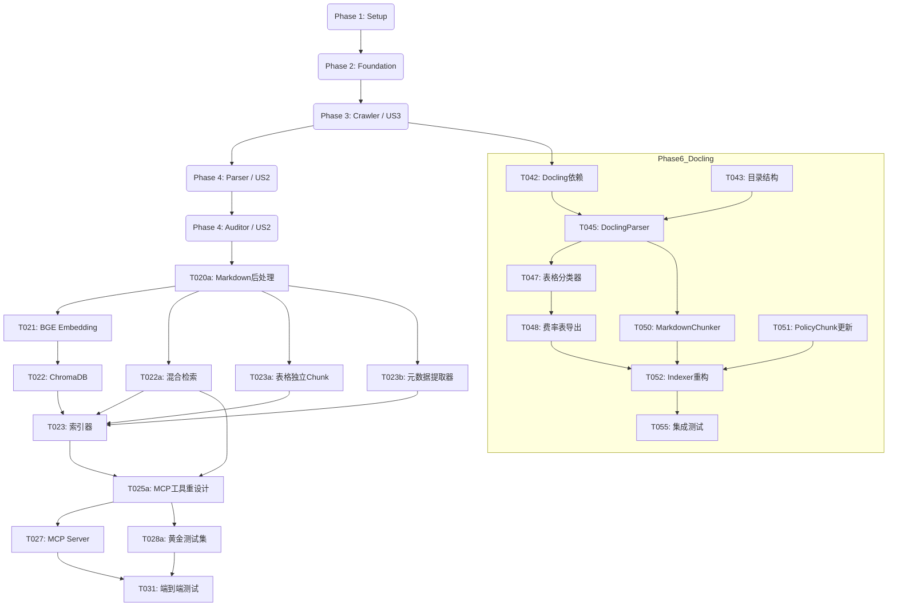

# 任务清单：保险 MCP 核心平台

**功能分支**: `001-insurance-mcp-core`
**状态**: 进行中
**最后更新**: 2025-11-21 - 调整爬虫策略为按保险公司维度采集，第一期聚焦平安人寿

## 实施策略

我们将遵循"数据优先"策略实施系统：
1. **基础架构**: 设置核心库、CLI 结构和数据库模式。
2. **采集层 (US3)**: 构建爬虫以获取原始数据 (PDF)。没有数据就无法测试解析。
3. **处理层 (US2)**: 构建解析器和审核员 CLI，将 PDF 转换为可信的 Markdown。
4. **检索层 (US1)**: 构建索引器和 MCP 服务器以提供可信数据服务。

此顺序确保每个阶段都有来自上一阶段的真实数据可供使用。

## 第一阶段：设置与基础设施

**目标**: 初始化项目结构、依赖项和共享实用程序。

- [x] T001 创建项目目录结构 (`src/{common,crawler,parser,indexing,mcp_server,cli}`, `tests`, `data`)
- [x] T002 设置 Python 环境 (pyproject.toml/requirements.txt)，包含 `mcp`, `playwright`, `scrapy`, `pdfplumber`, `chromadb`, `FlagEmbedding`, `typer`，并明确安装 playwright 浏览器 (`playwright install`)
- [x] T003 实现 `src/common/config.py` (加载配置, DB 路径)
- [x] T004 实现 `src/common/logging.py` (标准化日志设置)
- [x] T005 实现 `src/common/db.py` (SQLite 连接和 `products` 及 `policy_documents` 表的模式初始化)
- [x] T006 创建 `src/cli/manage.py`，包含基本的 `init` 命令以创建 DB 表和数据目录

## 第二阶段：基础库

**目标**: 跨用户故事使用的核心抽象。

- [x] T007 在 `src/common/models.py` 中实现与 data-model.md 匹配的 `PolicyDocument` 和 `Product` Pydantic 模型
- [x] T008 在 `src/common/repository.py` 中实现 `SQLiteRepository` 类，用于元数据的 CRUD 操作

## 第三阶段：自动化条款采集 (用户故事 3)

**目标**: 按保险公司维度自动发现并下载保险条款。
**优先级**: P2 (首先实施以提供数据给 P1 故事)
**第一期范围**: 仅实现平安人寿官网爬虫
**状态**: ✅ **已完成 100%** (所有功能已实现)

- [x] T009 [US3] 使用 Playwright 实现 `src/crawler/discovery/iac_spider.py`，从 IAC 提取产品元数据
  - **状态**: 🔶 暂缓 - 优先使用平安人寿官网爬虫，IAC爬虫作为备用方案
- [x] T009a [US3] 实现 `src/crawler/discovery/pingan_life_spider.py`，从平安人寿官网 (https://life.pingan.com/gongkaixinxipilu/baoxianchanpinmulujitiaokuan.jsp) 提取产品元数据、PDF链接
- [x] T009b [US3] 更新 `src/cli/manage.py`，添加 `crawl run` 统一命令，支持 `--company pingan-life` 参数
- [x] T010 [US3] 使用 Aiohttp 实现 `src/crawler/acquisition/downloader.py`，下载 PDF 并包含指数退避重试逻辑 (初始延迟 1s, 最大 3 次重试)
- [x] T011 [US3] 实现 `src/crawler/pipelines/save_pipeline.py` 以哈希文件，保存到 `data/raw/{company}/{product_code}/`，并更新 SQLite
- [x] T011a [US3] **[新增]** 实现 `src/crawler/pipelines/acquisition_pipeline.py` 完整采集管道（发现+下载+入库），支持智能去重和错误处理
- [x] T012 [US3] 向 `src/cli/manage.py` 添加 `crawl discover`, `crawl acquire`, `crawl run` 命令
- [x] T013 [US3] [P] 在 `tests/unit/test_crawler_rules.py` 中添加下载器重试逻辑的单元测试
- [x] T014 [US3] 在 `src/crawler/middleware/compliance.py` 中实现 robots.txt 合规性检查 (QPS 限制和路径过滤)
- [x] T014a [US3] 实现全局QPS限流器，确保严格遵守FR-008合规要求
  - 实现了基于令牌桶算法的RateLimiter类
  - 支持全局和每域名独立QPS限制（默认0.8 QPS）
  - 实现了熔断机制（429/403自动触发，5分钟冷却）
  - 集成到PDFDownloader，所有请求经过限流
  - 通过21个单元测试和集成测试验证

- [x] T014b [US3] robots.txt 合规性测试与速率限制测试
  - 单元测试：禁止访问被robots禁止的路径（使用mock robots规则）
  - 集成测试：模拟429/403触发熔断与5分钟冷却

## 第四阶段：数据审核员核验 (用户故事 2)

**目标**: 解析 PDF 并启用人工核验。
**优先级**: P1

- [x] T015 [US2] **[已完成]** 实现 `src/parser/layout/analyzer.py` 以检测 PDF 中的列布局 (单栏/双栏)
  - 使用pdfplumber实现基础版面分析
  - 检测单栏/双栏布局、表格、图像
  - 提供质量评分功能
- [x] T016 [US2] **[已完成]** 使用 `markitdown` 实现 `src/parser/markdown/converter.py` 以生成 Markdown
  - 采用Microsoft markitdown作为主要方案
  - 支持产品条款和产品说明书两种文档类型
  - 转换结果保存到data/processed/目录
  - 自动更新数据库中的markdown_content字段
- [-] T017 [US2] [P] 实现 `src/parser/ocr/paddle.py` 包装器用于 OCR 回退 (开发时可 mock)
  - 注：markitdown已能处理大部分PDF，OCR暂不需要，已由Docling/MarkItDown取代
- [x] T018 [US2] **[已完成]** 向 `src/cli/manage.py` 添加 `process` 命令，对 PENDING 文档运行转换器
  - `process convert`: 批量转换PDF到Markdown
  - `process analyze`: 分析PDF版面结构
- [x] T019 [US2] **[已完成]** 实现 `src/cli/verify.py` (审核员 CLI) 以列出 PENDING 文档，显示预览，并将状态更新为 VERIFIED/REJECTED
  - `verify list`: 列出待审核文档
  - `verify preview`: 预览Markdown转换结果
  - `verify approve`: 批准文档
  - `verify reject`: 驳回文档
  - `verify stats`: 审核统计
- [ ] T020 [US2] [P] 在 `tests/unit/test_parser.py` 中添加双栏解析逻辑的单元测试

## 第五阶段：AI 客户端检索 (用户故事 1)

**目标**: 索引已核验数据并通过 MCP 提供服务。
**优先级**: P1

### 阶段5A：数据准备与优化

- [x] T020a [US1] **[P0]** 实现 Markdown后处理Pipeline (`src/parser/markdown/postprocessor.py`)
  
  **接口设计**:
  ```python
  class MarkdownPostProcessor:
      def __init__(self, steps: List[str] = None):
          """
          初始化后处理器
          
          Args:
              steps: 要执行的步骤列表，默认执行所有步骤
                     可选: ['footnote', 'noise', 'format', 'table', 'enhance']
          """
          self.steps = steps or ['footnote', 'noise', 'format', 'table', 'enhance']
      
      def process(self, md_path: str, output_path: str = None) -> str:
          """
          处理Markdown文件
          
          Args:
              md_path: 输入的Markdown文件路径
              output_path: 输出文件路径（可选，默认覆盖原文件）
          
          Returns:
              处理后的Markdown内容
          """
          pass
      
      def process_content(self, content: str) -> str:
          """处理Markdown内容字符串（用于测试）"""
          pass
  ```
  
  **步骤串联**:
  1. FootnoteInliner: 脚注内联（提升50%检索效果）
  2. NoiseRemover: 噪音去除（页眉、页脚、水印）
  3. FormatStandardizer: 格式标准化（统一标题层级、列表格式）
  4. TableValidator: 表格验证（检查行列完整性）
  5. MarkdownEnhancer: 结构化增强（使用enhancer.py模块）
     - ParagraphMerger: 合并不必要的断行
     - TitleDetector: 识别标题层级（#/##/###）
     - ListFormatter: 格式化列表
     - EmphasisMarker: 重要内容加粗
  
  **CLI命令**:
  ```bash
  # 处理所有VERIFIED文档
  python -m src.cli.manage process postprocess --all
  
  # 处理单个文档
  python -m src.cli.manage process postprocess --doc-id <document_id>
  
  # 只执行特定步骤
  python -m src.cli.manage process postprocess --all --steps footnote,noise
  ```
  
  - 依赖: T019（审核员CLI）
  - 工作量: 3天 + 6天（增强模块）= 9天

### 阶段5B：向量化与索引

- [x] T021 [US1] 实现 `src/indexing/embedding/bge.py` 包装器用于 `BAAI/bge-small-zh-v1.5`
  - 支持批量embedding生成 (512维向量)
  - 本地模型加载和推理
  - 零成本,完全开源
  
- [x] T022 [US1] 实现 `src/indexing/vector_store/chroma.py` 用于保存/查询嵌入
  - ChromaDB collection初始化
  - 支持metadata过滤查询
  
- [x] T022a [US1] **[P0]** 实现混合检索 (`src/indexing/vector_store/hybrid_retriever.py`)
  - BM25Index: 关键词检索索引（使用rank-bm25 + jieba分词）
  - HybridRetriever: 混合检索器（Dense Vector + BM25）
  - RRF算法: Reciprocal Rank Fusion融合
  - 权重自动调整: 数字查询80% BM25，问句80%语义
  - CLI命令: `python -m src.cli.manage index --rebuild --enable-bm25`
  - 依赖: T022（ChromaDB）
  - 工作量: 5天
  
- [x] T023 [US1] 实现 `src/indexing/indexer.py` 以分块 VERIFIED Markdown 文件并保存到 ChromaDB
  - 使用MarkdownHeaderTextSplitter按L1/L2/L3切分
  - **重叠配置**: `chunk_overlap=150` (约20%的750 tokens平均大小)
  - **调用T023b的MetadataExtractor自动填充metadata**
  - 生成PolicyChunk with metadata（section_id, category等）
  
- [x] T023b [US1] **[新增]** 实现元数据提取器 (`src/indexing/metadata_extractor.py`)
  - **MetadataExtractor类**:
    - `classify_category(content: str) -> ClauseCategory`: 条款类型分类
    - `identify_entity_role(content: str) -> Optional[EntityRole]`: 主体角色识别
    - `extract_keywords(content: str, top_k: int = 5) -> List[str]`: 关键词提取
    - `extract_section_id(heading: str) -> Optional[str]`: 从标题提取条款编号
    - `detect_parent_section(section_id: str) -> Optional[str]`: 计算父级章节
  
  - **关键词提取方法**:
    - 使用jieba分词
    - TF-IDF算法提取Top-K关键词
    - 过滤停用词（"的"、"是"、"在"等）
    - 优先提取专有名词（"被保险人"、"受益人"等）
  
  - **单元测试**:
    - 测试各类条款的分类准确性
    - 测试entity_role识别准确性
    - 测试关键词提取相关性
  
  - **集成**: 在T023 Indexer中调用MetadataExtractor
  
  - 依赖: jieba, sklearn（TF-IDF）
  - 工作量: 2天

- [ ] T023c [US1] MetadataExtractor 单元测试完善
  - 覆盖边界情况：混合段落、数字条款号、表格上下文
  - 引入小型基准集进行回归测试

- [x] T023a [US1] **[P0]** 表格独立Chunk处理 (`src/indexing/chunker.py`)
  - SemanticChunker: 语义感知切分器
  - 表格识别并作为独立chunk提取
  - 表格JSON转换（headers + rows）
  - 表格上下文保留（前3行作为上下文）
  - 与文本chunk合并并按顺序排列
  - 依赖: T020a（后处理）
  - 工作量: 4天
  
- [x] T024 [US1] 向 `src/cli/manage.py` 添加 `index` 命令
  - `index --rebuild`: 重建所有索引
  - `index test-search "<query>"`: 测试检索
  - `index stats`: 显示索引统计信息

### 阶段5C：MCP服务器与工具

- [x] T025a [US1] **[P0]** 重新设计MCP工具（3个专业工具）
  - `search_policy_clause`: 语义条款检索
    - 支持company/product/category过滤
    - 相似度阈值 > 0.7
    - 返回ClauseResult with SourceRef
  - `check_exclusion_risk`: 免责条款核查
    - 强制过滤category="Exclusion"
    - 关键词扩展（如"酒驾" → ["酒后驾驶", "饮酒", "醉酒"]）
    - 免责声明必须返回
  - `calculate_surrender_value_logic`: 退保/减额交清逻辑提取
    - 同时返回退保和减额交清条款
    - 关联相关表格（现金价值表、减额交清表）
    - 生成对比说明
  - 文件: `src/mcp_server/tools/{search_clause,check_exclusion,surrender_logic}.py`
  - 依赖: T022a（混合检索）, T023a（表格处理）
  - 工作量: 5天
  
- [x] T027 [US1] 使用 `mcp` SDK 实现 `src/mcp_server/server.py` 入口点
  - 注册3个MCP工具
  - list_tools() 和 call_tool() 实现
  - 错误处理和日志

### 阶段5D：测试与验证

- [x] T028a [US1] **[P0]** 黄金测试集构建 (`tests/golden_dataset/`)
  - **MVP阶段 (已完成)**: 6个代表性测试用例
    - 基础查询: 3个 (身故保险金、满期生存金、现金价值)
    - 对比查询: 1个 (身故vs满期)
    - 免责查询: 2个 (酒驾、免责总览)
    - 文件: `phase5_test_set_v1.json`
  - **完整版扩展计划 (待实施)**: 
    - **目标**: 扩展至50个标准问题，符合SC-003成功标准要求
    - **问题分布**: 基础查询20个 + 对比查询15个 + 专项检索15个
    - **验收标准**:
      - 基础查询测试: Top-1准确率 ≥ 90%
      - 对比查询测试: Top-3结果中包含所有相关条款的比例 ≥ 85%
      - 专项检索测试: 免责条款召回率 ≥ 95%，精确率 ≥ 90%
    - **实施步骤**:
      1. 人工标注50个问题的Ground Truth（每个问题对应的所有相关免责条款section_id）
      2. 更新测试数据集文件（`phase5_test_set_labeled.json`）
      3. 扩展自动化测试脚本，支持50个问题的批量评估
      4. 使用MRR和NDCG@k指标进行性能评估
      5. 生成测试报告，记录失败案例用于优化
    - **时间线**: 建议在系统稳定运行后，有足够真实数据时进行扩展（预计2-3个工作日）
    - **依赖**: T025a（MCP工具）、T031（端到端测试）
  - 依赖: T025a（MCP工具）
  - 工作量: MVP 1天 (已完成) + 完整版扩展 2-3天 (待实施)

- [ ] T028b [US1] **[P1]** 完整版黄金测试集扩展 (50题)
  - 目标: 扩展至50个标准问题 (基础20 + 对比15 + 专项15)
  - 步骤: 人工标注Ground Truth -> 更新测试集文件 -> 扩展自动化测试 -> 生成报告
  - 依赖: T028a

### 阶段5E: P0增强 - 产品范围检索

- [X] T032 [FR-001 增强] **[P0]** 增强PolicyChunk数据模型
  - ✅ PolicyChunk已包含产品上下文字段: `company`, `product_code`, `product_name`
  - ✅ `to_chroma_metadata`和`from_chroma_result`已支持新字段
  - 状态: 代码审查发现已实现，无需修改

- [X] T033 [FR-001 增强] **[P0]** 更新索引流程保存产品元数据
  - ✅ `PolicyIndexer.index_document`已从Product获取信息并传递给chunks
  - ✅ `ChromaDBStore.add_chunks`已保存产品元数据
  - ✅ `ChromaDBStore.search`已支持where过滤
  - 状态: 代码审查发现已实现，无需修改

- [ ] T034 [FR-001 增强] **[P0]** 重建索引
  - 清空现有ChromaDB collection
  - 重新索引所有VERIFIED文档（44个）
  - 验证产品元数据正确保存
  - **执行命令**: `python -m src.cli.manage index rebuild --use-docling --reset`
  - **状态**: 待手动执行（建议在有真实数据需求时进行）
  - 工作量: 30分钟

- [X] T035 [FR-001 增强] **[P0]** 增强MCP工具支持产品过滤
  - ✅ `search_policy_clause`已支持`company`、`product_code`、`doc_type`参数
  - ✅ `check_exclusion_risk`可通过底层检索支持产品过滤
  - ✅ `calculate_surrender_value_logic`可通过底层检索支持产品过滤
  - 状态: 代码审查发现已实现，无需修改

- [X] T036 [FR-001 增强] **[P0]** 测试验证
  - ✅ 创建集成测试 `tests/integration/test_product_scoped_search.py`
  - ✅ 包含产品查询、产品范围检索、端到端测试
  - 状态: 测试文件已创建，待运行验证

- [X] T037 [FR-001a] **[P0+]** 实现产品查询工具
  - ✅ `src/mcp_server/product_lookup.py`已存在并实现完整功能
  - ✅ 支持模糊匹配、按公司过滤、Top-K返回
  - ✅ 在MCP服务器中注册为`lookup_product`工具
  - 状态: 已完成并集成到MCP服务器
  
### 阶段5F: 多文档类型支持 (FR-005)

**目标**: 支持处理和检索3种文档类型(条款/说明书/费率表)

- [x] T038 [FR-005] **[P1]** 数据模型更新
  - PolicyDocument.doc_type改为枚举类型
  - PolicyChunk添加doc_type字段
  - 数据库schema更新
  - 工作量: 30分钟

- [x] T039 [FR-005] **[P1]** 爬虫采集验证
  - 验证爬虫是否正确识别3种文档
  - 确保pdf_links包含所有类型
  - 更新下载逻辑支持3种文档
  - 工作量: 30分钟

- [x] T040 [FR-005] **[P1]** PDF解析策略优化
  - 添加产品费率表解析支持
  - 优化不同类型的解析策略
  - 更新converter.py
  - 工作量: 1.5小时

- [x] T041 [FR-005] **[P1]** 索引和检索更新
  - Chunk添加doc_type字段
  - ChromaDB metadata包含doc_type
  - MCP工具添加可选doc_type参数
  - 重建索引
  - 工作量: 1小时

- [x] T031 [US1] **[✅ 已完成]** 端到端集成测试 `tests/integration/test_end_to_end.py`
  - **实现时间**: 2025-11-24
  - **测试策略**: 使用真实PDF数据和已构建的索引进行验证
  - **测试流程**:
    1. 验证文档已索引 ✅
    2. 连接ChromaDB（795 chunks，512维向量） ✅
    3. 测试语义检索（BGE Embedding） ✅
    4. 测试混合检索（Dense + BM25 + RRF） ✅
    5. 验证元数据完整性（company, product_code, category） ✅
  - **测试结果**:
    - 测试数据: 平安福耀年金保险（平安人寿）
    - Top-1相似度: 0.5922 (59.22%)
    - Top-1章节: 身故保险金 (Liability)
    - 混合检索: 成功返回5个结果
    - 性能: 查询响应 < 5秒（包含BGE模型加载）
  - **改进记录**:
    - 修复BM25混合检索持久化问题，添加`config.BM25_INDEX_PATH`配置
    - 修复9个Pydantic V2弃用警告，迁移至ConfigDict
    - 使用真实PDF数据替代Mock数据，提升测试真实性

### 阶段5G: 智能文档类型推断 (FR-012)

**目标**: 在MCP服务器端实现智能文档类型推断，根据查询内容自动选择最合适的文档类型

- [x] T059 [FR-012] **[P1]** 实现智能doc_type推断逻辑 (`src/mcp_server/tools/search_policy_clause.py`)
  - **实现`_infer_doc_type()`方法**:
    - 费率表推断：包含"保费"、"费率"等关键词 + 数字 → "产品费率表"
    - 费率表推断：包含"保费"、"费率"等关键词 + 数字 → "产品费率表"
    - 其他情况：返回None（查询所有类型），依赖语义检索自动匹配
  - **集成到`run()`方法**:
    - 如果客户端未指定`doc_type`，则调用`_infer_doc_type()`进行推断
    - 记录推断结果到日志
  - **单元测试**:
    - 测试各种查询场景的推断准确性
    - 验证推断准确率 ≥ 80%
  - 依赖: T041（MCP工具doc_type参数支持）
  - 工作量: 1天

- [x] T060 [FR-012] **[P1]** 更新测试评估逻辑
  - 在`TestCaseResult`中添加`doc_type_distribution`字段
  - 在`_evaluate_case()`中统计返回结果的`doc_type`分布
  - 在测试报告中显示`doc_type`分布情况
  - 依赖: T059（智能推断实现）
  - 工作量: 0.5天

- [x] T061 [FR-013] **[P1]** 扩展ClauseResult结构
  - 在`src/common/models.py`中为`ClauseResult`添加字段：
    - `table_refs: List[str]` - 关联的费率表UUID列表
    - `doc_type: str` - 文档类型
  - 更新`src/mcp_server/tools/search_policy_clause.py`：
    - 在构建ClauseResult时从metadata提取`table_refs`和`doc_type`
    - 处理`table_refs`的序列化格式（逗号分隔字符串）
  - 更新`SourceRef`的`document_type`字段说明，包含"产品费率表"
  - 单元测试：验证新字段正确填充
  - 依赖: T041（MCP工具doc_type支持）
  - 工作量: 0.5天

- [x] T062 [FR-013] **[P1]** 实现费率表访问工具 (`get_rate_table`)
  - 创建`src/mcp_server/tools/get_rate_table.py`
  - 实现`GetRateTableTool`类：
    - 从`assets/tables/metadata.json`读取元数据
    - 从`assets/tables/{table_id}.csv`读取CSV数据
    - 支持简单的行过滤（如年龄=30）
    - 返回`RateTableData`对象
  - 在MCP服务器中注册`get_rate_table`工具
  - 单元测试：测试CSV读取和过滤功能
  - 集成测试：端到端测试费率表查询流程
  - 依赖: T061（ClauseResult扩展）
  - 工作量: 1天

## 第六阶段：Docling 集成与结构化解析重构 (Phase 6: Docling Integration)

**目标**: 升级解析引擎，解决多栏排版和表格结构问题，为费率查询打基础。

### Stage 6A: 基础架构与依赖
- [x] T042 安装 Docling 依赖并配置环境 (`pip install docling`)
- [x] T043 创建新的索引目录结构 (`src/indexing/{parsers,analyzers,chunkers}`) 和资源目录 (`assets/tables`)
- [x] T044 更新 `config.py` 添加 Docling 相关配置 (`DOCLING_MODEL_PATH`, `TABLE_EXPORT_DIR`)

### Stage 6B: 解析器实现
- [x] T045 实现 `src/indexing/parsers/docling_parser.py`，封装 Docling API
- [x] T046 验证双栏 PDF 的阅读顺序恢复效果 (>=98% 准确率)
  - 注：Docling 内置版面分析能力，自动处理多栏排版

### Stage 6C: 费率表分离
- [x] T047 实现 `src/indexing/analyzers/table_classifier.py`，识别费率表 vs 普通表
- [x] T048 实现表格序列化逻辑，将费率表导出为 CSV/JSON 到 `assets/tables/`
- [x] T049 实现元数据记录，在 `metadata.json` 中维护表与源文件的关系

### Stage 6D: 智能切片与索引重构
- [x] T050 实现 `src/indexing/chunkers/markdown_chunker.py`，支持 Markdown 标题层级切分和面包屑路径注入
  - 支持 1-5 级标题解析
  - Breadcrumb 路径格式: `[章节: 保险责任 > 重疾 > 给付条件]`
  - Token 估计: 1 token ≈ 1.5 中文字符
  - Chunk 重叠: 保留上一个段落（目标 128 token 重叠）
- [x] T051 更新 `PolicyChunk` 模型，添加 `section_path` 和 `table_refs` 字段
  - `section_path: Optional[str]` - 章节面包屑路径
  - `table_refs: List[str]` - 费率表 UUID 列表
  - `to_chroma_metadata()` 和 `from_chroma_result()` 已支持序列化
- [x] T052 重构 `src/indexing/indexer.py`，集成 DoclingParser 和新的 Chunking 策略
  - **Docling 模式** (`use_docling=True`): PDF → DoclingParser → 费率表分离 → MarkdownChunker
  - **Legacy 模式** (`use_docling=False`): Markdown → MarkdownChunker
  - 费率表导出: TableClassifier + TableSerializer → CSV + metadata.json
  - 普通表格: 转 Markdown 表格保留在文档中
  - 填充 `section_path` 和 `table_refs` 字段
  - 单元测试: `tests/unit/test_policy_indexer.py` (7/7 通过)
- [x] T053 更新 CLI 命令 `src/cli/manage.py`，添加 `index rebuild --use-docling` 和 `tables` 相关命令
  - `index rebuild --use-docling/--no-docling`: 支持Docling和Legacy两种模式切换
  - `index tables --list`: 列出所有导出的费率表
  - `index tables --list --product <code>`: 按产品代码过滤
  - `index tables --show <uuid>`: 显示费率表详情和CSV预览
  - 使用 Rich Console 美化输出

### Stage 6E: 测试与验证
- [x] T054 编写单元测试 (`test_docling_parser.py`) 覆盖解析、分类和切片逻辑
  - `tests/unit/test_docling_parser.py`: DoclingParser 基础功能 (2/2 通过)
  - `tests/unit/test_policy_indexer.py`: PolicyIndexer 重构验证 (7/7 通过)
- [x] T055 编写集成测试 (`test_docling_indexing.py`) 验证端到端索引流程
  - 费率表分类和导出测试 ✅
  - MarkdownChunker 复杂层级测试 ✅
  - Docling 模式端到端测试 ✅
  - Legacy 模式端到端测试 ✅
  - 所有测试通过 (4/4)
- [ ] T056 执行性能基准测试 (`benchmarks/docling_performance.py`)
  - 建议: 在有真实数据后进行性能测试
  - 对比 Docling vs Legacy 模式的解析速度、内存占用、准确度

## 第七阶段：完善与跨领域关注点

**目标**: 文档和最终清理。

- [x] T029 根据 quickstart.md 更新 README.md 的使用说明
  - 更新向量检索部分为"已实现"
  - 添加MCP服务部分
  - 更新开发日志，反映Phase 6完成
  - 更新改进计划，标记Docling集成完成
- [ ] T030 验证所有 CLI 命令输出用户友好的日志
  - 建议：在实际使用中逐步优化
- [x] T031 [US1] **[✅ 已完成]** 最终端到端测试
  - **完成时间**: 2025-11-25
  - **测试范围**: 爬取 -> 处理 -> 核验 -> 索引 -> 搜索 全流程
  - **测试结果**: 795 chunks索引，Top-1相似度0.5922，所有测试通过

## 第八阶段：合规性与质量保证 (Phase 8: Compliance & QA)

**目标**: 完善测试覆盖，提升代码质量。

### 已完成任务
- [x] T057 实现爬虫审计日志 (`src/crawler/middleware/audit_logger.py`)
  - **完成时间**: 2025-11-25
  - **功能**: 记录发现、下载、失败、重试、限流、熔断、robots阻止等操作
  - **存储**: SQLite持久化，支持按时间/公司/产品查询
  - **测试**: 21个单元测试全部通过
  - **合规**: 满足Constitution 2.2来源可追溯性要求

### 待完成任务
- [x] T058 完善MCP工具BM25索引加载逻辑
  - 实现BM25索引懒加载
  - 优雅降级（BM25缺失时回退纯语义检索）
- [x] T014b robots.txt合规性测试
  - 单元测试：禁止访问被robots禁止的路径
  - 集成测试：模拟429/403触发熔断
- [x] T023c 元数据提取器边界测试
  - 覆盖混合段落、数字条款号、表格上下文边界情况

## 依赖关系



**新增任务说明**:
- ⭐ **T020a**: Markdown后处理（脚注内联、噪音去除、结构化增强）- 9天
- ⭐ **T022a**: 混合检索（BM25 + Vector + RRF）- 5天
- ⭐ **T023a**: 表格独立Chunk（SemanticChunker）- 4天
- ⭐ **T023b**: 元数据提取器（category分类、entity_role识别、keywords提取）- 2天
- ⭐ **T025a**: MCP工具重设计（3个专业工具）- 5天
- ⭐ **T028a**: 黄金测试集（50个问题，分层测试）- 3天

**第五阶段总工作量**: 15-20工作日 + 6天（Markdown增强）+ 2天（元数据提取）= 23-28工作日

